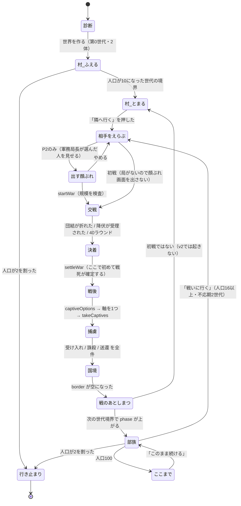

# 10 設計：進行ロジック（P1＋P2）

**sim の中身は1行も書き換えない。** sim がすでに持っている素材（`world.phase` / `pendingFirstWar` /
`reachedThreshold` / `fertBias` / `transparency` / `cards` / `border` …）を、
**進行層**という新しい層が組み合わせて「遊べる進行」にする。

この文書の主張は全部**実測で裏を取ってある**。数字はすべて `src/sim` を node で実際に回した結果で、
推測値は1つも書いていない（測定スクリプトは §12）。

---

## 0. この文書が決めること／決めないこと

| 決める | 決めない（他班） |
|---|---|
| 村が10体で止まる仕組みと、あふれた出生の行き先 | 画面の見た目・レイアウト（UI班） |
| 「先へ進む道は戦いだけ」の導線と、その瞬間に起きること | 用語の表示名・ホバー説明の文面（用語班） |
| 初戦を5対5にするための条件 | 村マップの描画（UI班） |
| 戦闘→捕虜→国境→戦後→フェーズ2 の**唯一正しい呼び出し順** | 遺伝・戦闘の係数（sim は不変） |
| 1世代の実時間、P1/P2 の所要時間 | 60問診断の中身 |
| 食料経済が破綻しない範囲 | |
| 絶滅・飢餓のときに見えるものと、できること | |

**この文書が上書きするもの**：`core/model.js` の `GEN_MS`、`ui/adapter.js` の `refreshWarReady`、
`ui/panels/border.js` の呼び出し順、`ui/main.js` の `announceFirstWar` の文面、`ui/cards.js`（丸ごと廃止）。

**この文書より優先されるもの**：`07-オーナー追加要件.md`。
そのうちロジック班に直接割り当てられた **A-2**（規模と「編成しない」境界の伝え方）は §6-7、
**A-3**（不応期の残り時間を出す）は §4-3、**A-1**（前世代との差分の材料を進行層が持つ）は §9-2 に入れた。

---

## 1. 進行層をどこに置くか

```
ui  →  flow  →  sim  →  core
```

新しいディレクトリ **`game/src/flow/`** を作る。依存の向きは一方向のまま（R-003）。

| ファイル | 持つもの |
|---|---|
| `flow/run.js` | 1回のプレイ＝`run`。`world` / `roster` / `rng` / `stage` / `clock` を持つ。状態遷移の本体 |
| `flow/village.js` | 村の人口上限（§3）と凍結（§4） |
| `flow/war.js` | 戦争の1本道（§6）。**戦争に関する sim 呼び出しは、全部ここを通る** |
| `flow/clock.js` | 時間（§7）。1世代の実時間、速度、tick の進め方 |
| `flow/rules.js` | 定数を1か所に集める（上限10・最低人口16・不応期2世代…） |

**掟**：`ui/panels/*.js` から `api.startWar` / `api.settleWar` / `api.takeCaptives` /
`api.borderDecision` を直接呼ぶことを**禁止する**。呼べるのは `flow/war.js` の関数だけ。
いま UI と test と roster で呼び順が3通りに割れているのは、呼び口が3つあるからで、
順番を直しても呼び口が3つ残っていれば必ずまた割れる。

### sim に必要な唯一の変更（挙動は変えない）

`game/src/sim/index.js` に **1行の再エクスポートを足す**。

```js
export { ..., applySideLosses, ... } from './battle.js';
```

`applySideLosses` は `roster.js` が国どうしの戦争で両側に損耗を書き戻すのに使っている関数で、
**公開APIに出ていない**。出ていないせいで、プレイヤーの戦争だけ相手世界に何も書き戻されず、
「全滅させても相手の人口が減らない／同じ人物を何度でも連れ帰れる」という致命バグ（03班）が起きている。
関数の中身は触らない。公開面を広げるだけ。

---

## 2. 状態遷移

### 2-1 全体図



### 2-2 状態の表

`run.stage` は常にこの12個のどれか1つ。**同時に2つにならない。**

| stage | 世界の時計 | 見えるもの | 押せるもの | 出口 |
|---|---|---|---|---|
| `OPENING` | 止まっている | 60問／保存した種族 | 答える・飛ばす | 世界を作る |
| `VILLAGE_GROW` | 動く | 村マップ・住人・食べもの | 配役・個体を見る・速度 | 人口10 |
| `VILLAGE_FULL` | **完全に止まる** | 同上＋「隣へ行く」常設 | 配役・個体を見る・**隣へ行く** | 隣へ行く |
| `WAR_PICK` | 止まる | 相手の候補 | 相手を1つ選ぶ・やめる | 顔ぶれ（P2）／開戦（初戦） |
| `WAR_FORCE` | 止まる | 軍務局長が選んだ名簿と、歪められた数字（§6-7） | 行かせる・やめる | 開戦 |
| `WAR_FIGHT` | 止まる | 戦闘。両軍の団結と名簿 | **降伏だけ** | 決着 |
| `WAR_SETTLE` | 止まる | 誰が死に、誰が逃げたか（確定値） | 進む | 捕虜へ |
| `WAR_CAPTIVE` | 止まる | 勝者なら軸7つ／敗者は説明のみ | 軸を1つ選ぶ | 引く |
| `WAR_BORDER` | 止まる | 捕虜1人ずつ（階級のみ） | 受け入れ／誅殺／送還 | 全件終わり |
| `WAR_DONE` | 止まる | 戦のまとめ | 世界へ戻る | 世界へ |
| `TRIBE` | 動く | 部族。3局の報告・願い・年代記 | 裁く・敷く・置く・戦いに行く | 人口100／2未満 |
| `ENDED` | 止まる | 行き止まり or ここまで | 見続ける／やり直す | — |

**時計の持ち主は常に1つ**（`run.clock` = `'world'` / `'stopped'`）。
`'stopped'` のあいだは **▶ 進める も ×1〜×8 も押せない**（押せない理由をホバーで出す）。
「決断待ちのモーダルの裏で時間が進む」（04班）は、幕の CSS ではなく**ここで**塞ぐ。

---

## 3. 村の人口上限：10で止める

> **R-104**　村は10体で止まる。10を超えて増え続けてはいけない。先へ進む道は初戦だけ。
> **R-105**　10という数の理由は3つとも可読性（捕虜1体の色が見える／個体が識別できる／パニックが見える）。

### 3-1 いまの実装が止めていない理由

`world.js:457` がやっているのは **旗を立てることだけ**で、繁殖を止める行が1行もない。

```js
if (w.people.size >= PHASE_THRESHOLD[1]) w.reachedThreshold = true;   // world.js:457
```

実際に効く天井は `MAX_POP = 400` と `LAND_MAX 45 × POP_PER_LAND 2.6 ≒ 117` だけで、
どちらも 10 と無関係。実測：戦争に行かなければ第20世代で人口 60〜173、フェーズはずっと「村」。

`MAX_POP` は `constants.js` の `export const` なので、**外から差し替えられない**。
だから「sim の内側で止める」は、sim を書き換えない限り不可能。進行層でやる。

### 3-2 決定：止めるのは進行層。2段構え。

**段A（近づいたら細くする）— 世代を進める直前に `w.fertBias` を絞る**

```js
// flow/village.js
w.fertBias   = clamp((10 - w.people.size) / 3, 0, 1);   // 村フェーズのみ
w.transparency = 0.9;                                    // 理由は §3-5
```

`fertBias` は `world.js:629` の `breedGeneration` が読む世界の値で、繁殖の総量に掛かる。
乱数を消費しないので決定性（R-001）に触らない。

`/3` の根拠は実測。20種で回した結果：

| 分母 | 10体に到達 | 平均世代 | 最遅 | 到達時に人口ちょうど10 |
|---|---|---|---|---|
| `/3` | **20/20** | **4.1** | **6** | **20/20** |
| `/4` | 20/20 | 4.7 | 14 | 20/20 |
| `/5` | 20/20 | 5.8 | 16 | 20/20 |

`/3` を採る。R-008「P1は3〜4世代で通過」に一番近く、最遅でも6世代。

**段B（あふれたら村から出す）— 世代を進めた直後に切り詰める**

```js
// flow/village.js — 乱数を使わない。生まれ順の後ろから
let over = w.people.size - 10;
const newborns = [...w.people.values()]
  .filter(p => p.born === w.gen)          // その世代に生まれた子だけ
  .sort((a, b) => b.id - a.id);           // 遅く生まれた順
for (const p of newborns) {
  if (over-- <= 0) break;
  const ev = sim.kill(w, p, '旅立ち');
  ev.text = `${p.name}は生まれてすぐ村を出て行った`;
  p.deathCause = '村を出た';
}
```

**絶対規則：切り詰めるのは必ずその世代の新生児だけ。すでに村にいる住人には決して触らない。**
オーナーは10体全員の名前を知っている（R-110）。名前を知っている個体が上限のせいで消えるのは、
P1の体験そのものの破壊になる。

### 3-3 あふれた出生はどうなるか（言葉で決める）

**「生まれてすぐ村を出て行く」を採る。**

画面に出す1行はこれ：

> **村の畑は10人ぶんしかない。◯◯は生まれてすぐ村を出て行った。**

他の2案を採らない理由：

| 案 | 採らない理由 |
|---|---|
| **生まれない**（`fertBias` を0にするだけ） | 10を跨ぐ世代を止められない。人口8のとき一度に4人生まれると12になり、`MAX_POP` は外から差し替えられないので途中で止める手段がない。実測でも段Aだけでは 11〜14 になる世代が出る |
| **飢える**（餓死させる） | **嘘になる。** 上限に着いた時点の備蓄は実測 36〜75 で、蔵は満杯に近い。食べものが余っているのに餓死表示を出すのは R-009「事実は常に正確に見える」に正面から反する |

「出て行く」を採るいちばん大きな理由は、**なぜ止まるのかが1行で説明できる**ことにある。
「村の畑は10人ぶん」→「だから11人目の居場所がない」→「村を広げる手立ては村の中にない」→
「**先へ進む道は戦いだけ**」（R-104）。この4行が一続きになる言い方は、これしかない。

出て行った子は世界から消える（血統は途切れる）。ただし**年代記には残る**。
死因は `旅立ち` で、戦死・餓死・老衰とは別に数える。P2に上がったあと、あのとき出て行った子らは戻らない。

### 3-4 上限に着いたら世界を完全に止める

**これは §4 の話でもあるが、人口上限の一部でもあるのでここに書く。**

最初は「世代だけ止めて tick は動かす」を試した。**実測で壊れた。**

上限に着いてから tick だけ480回（＝実時間で約50分）空回しした20種の結果：

| 何が起きたか | 件数 |
|---|---|
| 狩りの事故で人が減った | **12/20**（1〜4体） |
| 人口が10を割り、初戦が **4対4** になった | **2/20** |
| 練度が伸びた（初戦が「練度ゼロの新兵同士」でなくなる） | 20/20（合計 +0.28〜+3.97） |
| 餓死 | 0/20 |

R-202（5対5）が 10% の確率で壊れ、R-116（初戦は素質と運で決まる／練度ゼロ）も壊れる。

**決定：`VILLAGE_FULL` では tick も世代も完全に止める。**

- 保証されること：人口ちょうど10（実測 20/20）／初戦は必ず5対5（実測 40/40）／
  練度が伸びない＝初戦は素質と運で決まる（R-116）／狩りの事故で村が削れない
- 失うもの：上限に着いてから配役を変えても産出が動かない。
  ただし上限では**もう子が生まれないので産出が意味を持たない**。失うものは実質ゼロ
- 画面の言い方：**「村は10体で止まりました。時間も止まっています。次に何かが起きるのは、隣へ行ったときです。」**
  ——この文はいま初めて**本当のこと**になる。

### 3-5 P1では透過率を 0.9 に固定する

`w.transparency`（透過率＝制度の緩さ × 測定精度）の初期値は 0.5。
`autoAssign`（`world.js:581`）は `rng.next() > transparency` のとき**父の役をそのまま継がせる**。

創世のアダムは狩人なので、村中が狩人になる。実測：**第1〜6世代の農夫が0人**。
農夫が0人だと開墾が走らず土地が 18.0 → 15.8 に痩せ、第7世代で `landFactor` 0.64、第9世代で 0.32
（01班）。これが「第7世代で1回目の飢饉」の正体で、食べすぎではなく**土地が痩せたこと**が原因。

**決定：村フェーズのあいだ `w.transparency = 0.9` に固定する。**

理屈は制度ではなく事実による。**10体の村に「家柄」は存在しない。**
全員が創世の2体の子で、家業も身分も差がない。R-807「タダで手に入る信号は出自だけ」が成立するのは、
出自が分かれてからで、村ではまだ分かれていない。だから村では適性で配役される。

フェーズ2に上がった瞬間に 0.5 に戻し、以降は `hereditary`（世襲を尊重する）カードが握る（R-320・R-323）。
**ここが「世襲が起動する」瞬間で、P2で家系が分岐する（R-305）ことの実体になる。**

### 3-6 実測（この設計をそのまま回した結果・20種）

| 測ったもの | 結果 |
|---|---|
| 人口10に到達 | **20/20** |
| 到達したときの人口がちょうど10 | **20/20** |
| 到達までの世代 | 平均 **4.1** / 中央 4 / 最遅 6 |
| 到達までに村を出た子 | 平均 0.8体（0〜5） |
| 到達時の備蓄 | 36〜75（飢饉なし） |
| 村フェーズでの餓死 | **0/20** |
| 同じ種で2回まわして歴史が完全一致 | **10/10**（R-001・R-A1） |

---

## 4. 「先へ進む道は戦いだけ」の導線

> **R-104 / R-205**　強制されるのはフェーズ移行時の戦争だけ。それ以外は完全に自由。

### 4-1 戦いに行けるようになった瞬間に何が起きるか

人口が10になった世代の境界で、`stage` が `VILLAGE_GROW` → `VILLAGE_FULL` に変わる。
そのとき起きることを全部並べる。

| | 前（`VILLAGE_GROW`） | 後（`VILLAGE_FULL`） |
|---|---|---|
| 出生 | 起きる | **起きない** |
| 加齢・老衰 | 起きる | **起きない** |
| 食べもの・練度・疲労 | 動く | **動かない**（時計が止まる） |
| 世代カウンタ | 進む | **止まる**。トップバーに「止まっています」と理由 |
| ▶ 進める・×1〜×8 | 押せる | **押せない**（理由をホバーで出す） |
| 直接配役 | できる | **できる**（R-201：初戦の前に取り上げてはいけない） |
| 個体を見る | できる | できる |
| **「隣へ行く」** | 無い | **常設。押すまで消えない** |

### 4-2 合図の出し方

1. **モーダルを1回だけ出す**（`dismissable: false`、多重表示ガードあり）。
   中身は3つだけ。1画面に1つの用件（R-904）。
   - いま何体か → **`w.people.size` を読んで出す**。固定文の「10体になった」は禁止
   - なぜ増えないか → 「村の畑は10人ぶんしかない」
   - 出口は1つ → 「隣へ行く」

   **モーダルの中の数字は全部世界から読む。** いまの `announceFirstWar`（`main.js:218`）は
   「規模 5対5」「連れ帰る数1体」まで固定文で書いてある。これは §5・§6 で
   **本当に5対5・本当に1体**になるので、固定文をやめて実際の値を出せば嘘でなくなる。

2. 閉じたあと、**トップバーの下に常設の1行**を出す。押すまで消えない。

   > 村は10体でいっぱい。時間は止まっています。　**［隣へ行く］**

3. **強制はしない**（R-011）。「もう少し村を見る」を選べば、村は本当に10体のまま静止する。
   いまトーストが言っている「押すまで村は10体のまま」は、この設計で初めて本当のことになる。

### 4-3 P2で「戦いに行く」が出ない条件（＝オーナーの「戦いにいけない」の正体）

> **07-A-3**　不応期を残すなら**残り時間を必ず画面に出す**こと。消えるボタンは「壊れている」と読まれる。

いまは条件を満たさないと**ボタンが黙って消える**（`main.js:420`）。しかもP2は1世代60分なので、
**最大2時間ボタンが出ない**。これがオーナーの「戦いにいけない」のいちばん有力な正体。

**決定：ボタンは常に出す。押せないときは、押せない理由と「あと何分か」を書く。**

| 条件 | 満たさないとき画面に出す文 |
|---|---|
| 人口16以上 | 「いま◯体。戦いに出せるのは **16体** からです。あと◯体。」 |
| 前の戦から2世代 | 「前の戦から◯世代。**あと ◯分◯秒** で行けます。」 |
| 国境に捕虜が残っていない | 「国境に◯人が待っています。先に決めてください。　［国境をひらく］」 |

- **残り時間は世代ではなく実時間で出す。** 「あと2世代」は初見に何分か分からない。
  進行層は `clock.js` が持っている1世代の実時間と現在の速度から**分秒に換算して出す**
- 待っているあいだ、カウントダウンは動き続ける（止まった数字を置かない）
- 不応期が実時間で何分になるか：**P2は1世代180秒なので 2世代＝6分**（いまは最大120分）
- 国境に捕虜が残っている場合、**国境画面を開き直すボタンを必ず出す**。
  いまは再表示する手段が存在せず、捕虜が永久に宙に浮く（03班）

数字の根拠は §6-5（実測）。**初戦だけはこの3条件を全部無視する**（無視しないと村が10体で永久に止まる）。

---

## 5. 初戦を5対5にする

> **R-202**　初戦は5対5。ゴーストを国の規模で作ってはいけない。
> **R-105③**　5対5なら攻撃力の天才が恐怖で固まって死ぬのを目撃できる。

### 5-1 いま5対5にならない理由（3つ）

1. `matchEnemyForce`（`battle.js:247`）は `min(5, 相手の人口)`。相手に5人いなければ揃わない
2. UIが国力の昇順に並べて「迷ったらいちばん上」と薦めるので、**構造的にいちばん人がいない国を選ばされる**
3. 開発用「部族フェーズから開始」が `stepRoster` を呼ばず、10国が第0世代（人口2・国力7）のまま

### 5-2 決定：初戦の相手はロスターから選ばせない。「隣村」ゴーストを進行層が作る。

**理由**：R-202 が禁じているのは「ゴーストを**国の規模**で作ること」で、ゴーストを使うこと自体ではない。
初戦の相手は**国ではなく隣の村**である。設計文書の言葉も「隣のシャーレが見えている」。
ロスターの10国は**国**なので、初戦の相手にした瞬間に規模が合わなくなる。

```js
// flow/war.js
function makeNeighborVillage(run, i) {
  const seed = (run.world.seed ^ 0x51ed ^ Math.imul(run.world.gen + i, 2654435761)) >>> 0;
  const g = sim.makeGhost(seed, PHASE.VILLAGE, 1);   // ← power は 1。300 は禁止
  g.people = [...g.people]
    .sort((a, b) => sim.citizenPower(b) - sim.citizenPower(a))
    .slice(0, 5);                                     // ← ここで必ず5体に切り詰める
  return g;
}
```

要点を4つ。

- **`makeGhost(seed, PHASE.VILLAGE, 1)` は必ず 5体以上を作る**（`battle.js:38`：`5 + rng.int(4)`）。
  500種の実測で 5体127・6体128・7体128・8体117 ＝ **5体を割ることが構造的にない**。
  上位5体に切り詰めてから渡せば `matchEnemyForce` の `min(5, 5)` が必ず 5 になる
- **`power` は 1**。いま adapter は `makeGhost(Date0(), 1, 300)` を呼んでいて、
  `clamp01(rng.range(0, 0.30) * 300)` が上限に張り付く。実測：**練度の 99.0%（6378/6440項目）が 1.00**。
  `makeGhost(1, 村, 300)` は5体25項目すべて 1.00 ＝ **練度が全項目 MAX の最強の相手**が出る。
  `power = 1` なら練度は 0〜0.299 に収まり、「向こうも練度が浅い」（R-116）が成立する
- **種は `world.seed` から導く**。`Date0()` は定数1なので3つ作っても全部同じ村になる（R-001・R-002）
- ゴーストの個体は `age >= ADULT_AGE(2)` で作られるので、**乳児が戦場に出ない**

### 5-3 相手の見せ方（初戦だけの特例）

**候補は3つ。国力の数字は出さない。**

初戦に国力を出してはいけない理由は実測にある。02班の測定では、ある種族は
**国力26に負けて国力124に勝った**。国力は「マッチングの目安であって戦闘の入力ではない」（R-747）ので、
5対5の1戦の勝敗とは元々無関係。無関係な数字を1つだけ出して選ばせるのは、
数字を嘘にすることと同じになる。

出すのは2つだけ。

| 出すもの | 何から作るか |
|---|---|
| **色** | ゴーストの `hue`。ここで見た色が、連れ帰った1体の色になる |
| **一言** | ゴーストの遺伝子の狙い（`targets`）から導出。「狩りの村」「畑の村」「気の荒い村」 |

添える1行：**「どれを選んでも5対5です。ちがうのは血の色だけ。」**

ロスターの10国が出てくるのは**初戦の次から**（P2の任意の戦争）。
そこでは R-206 のとおり**国力しか見せない**。

### 5-4 自軍も必ず5体にする（検査で担保する）

`selectFirstWarForce`（`battle.js:226`）は成人が足りなければ1歳以上の子で埋める。
人口10なら成人4・子6が典型なので5体は常に揃う。

進行層は `startWar` の**直後に必ず検査する**。

```js
if (battle.firstWar && (home.units.length !== 5 || away.units.length !== 5)) {
  // 黙って 4対5 で始めない。開戦を捨てて作り直す
}
```

### 5-5 実測（40種）

| 測ったもの | 結果 |
|---|---|
| **5対5になった** | **40/40** |
| 勝率 | 48%（偏りなし） |
| ラウンド数 | 平均 7.3 / 最小 2 / 最大 15 |
| 自軍の逃走 | 平均 **1.8体**／5 |
| 決着した時点で見えている戦死 | 平均 **0.17体** |
| 追い討ち（`applyRout`）まで含めた戦死 | 平均 **1.13体** |
| **戦死のうち追い討ちで出た割合** | **85%（38/45体）** |
| 捕虜がちょうど1体 | **40/40** |
| 逃走も戦死も出なかった戦 | 11/40 |

**「戦死の85%は決着のあとに出る」が §6 の呼び出し順を決める。**

「逃走も戦死も出ない戦が 11/40」は残る問題。R-105③「練度ゼロのパニックが見える」が
4戦に1戦は成立しない。sim を触らない範囲でできるのは、**団結の推移と「誰が最初に怯んだか」を
主役にする**ことだけ（§6-4）。係数側の調整が要るかは §14 でオーナーに聞く。

---

## 6. 戦争の1本道（呼び出し順の確定）

### 6-1 いま3通りに割れている

| 呼び口 | 順番 |
|---|---|
| UI（`panels/border.js:54-66`） | captiveOptions → **takeCaptives** → borderDecision → **settleWar** |
| ロスター（`roster.js:112-130`） | **applyRout → settleWar** → **takeCaptives** → borderDecision |
| 検査（`test/integration.js:336-344`） | captiveOptions → **settleWar** → **takeCaptives** → borderDecision |

### 6-2 決定：**ロスターの順を正とする**

理由は3つ。

1. **`settleWar` の中で `applyRout`（敗走の追い討ち）が走る**（`battle.js:697`）。
   `takeCaptives` は `!u.dead` で絞る（`battle.js:558`）ので、settleWar より前に引くと
   **これから戦場で死ぬ体を連れ帰る**。実測で98戦のうち21件（21%）が該当（03班）
2. R-726「**捕虜は戦闘終了時の生存者から取る**」の「終了時」は、追い討ちまで含めた終了時
3. §5-5 の実測どおり、**戦死の85%は追い討ちで出る**。settleWar を後ろに置くと、
   戦闘画面は「戦死0体」と言い切って閉じ、そのあと3体が無言で消える。
   実測：98戦で画面に出た戦死6体／実際に消えた97体（03班）。**94%が画面に出ていない**

### 6-3 唯一の手順

`flow/war.js` が持つ。**これ以外の順番で sim を呼ぶ経路を作らない。**

| # | stage | 呼ぶもの | ここでしかやらないこと |
|---|---|---|---|
| S0 | `WAR_PICK` | `startWar(world, rng, foe)` | 直後に `battle.opponentRuthless = !!foe.ruthless` と `battle.homeName` を立てる。規模を検査 |
| S1 | `WAR_FIGHT` | `stepBattle(battle, rng)` ×N | 受け付けるのは降伏だけ（R-713） |
| S2 | `WAR_FIGHT` | `surrender(battle)` | 押されたときだけ。**返ってきた `options[]` の3択をそのまま出す** |
| S3 | `WAR_SETTLE` | **`settleWar(world, battle, rng, { priceIndex })`** | 中で `applyRout` が走り、**ここで初めて戦死が確定する** |
| S4 | `WAR_SETTLE` | `applySideLosses(foe._world, battle, 'away', rng)` | 相手世界への書き戻し。ゴーストには `_world` がないので何もしない |
| S5 | `WAR_SETTLE` | — | **確定した損耗を画面に出す。**「戦死◯・負傷◯・逃走◯」は `battle.summary` から読む |
| S6 | `WAR_CAPTIVE` | `captiveOptions(battle)` | **決着後にしか呼ばない**。勝者なら軸7つ |
| S7 | `WAR_CAPTIVE` | `takeCaptives(world, battle, axis, rng, 'home')` | 0体で返ることがある（殲滅した＝R-726） |
| S8 | `WAR_BORDER` | `borderDecision(world, capId, d)` ×全件 | 直後に `kill(foe._world, src, '捕縛')`（送還のときはしない） |
| S9 | `WAR_DONE` | — | `world.border` が空であることを確認して締める |
| S10 | `TRIBE` へ | `advanceGeneration` を**ここで初めて解禁** | `firstWarDone` が立っているので phase が上がる（R-201） |

### 6-4 各段で直すこと

**S0：`opponentRuthless` を進行層が立てる**
`startWar` はこの値を一切設定しない。立てているのは `roster.js:120` だけ。
だからプレイヤーの戦では**降伏が絶対に拒否されない**（`battle.js:487`）。
戦闘中の唯一の判断（R-720）にリスクが乗っていない状態なので、開戦時に必ず立てる。

**S1：戦闘が短すぎる。降伏を出す時間を作る**
いまは `STEP_MS = 230ms` × 平均7.3ラウンド ＝ **1.7〜3.5秒**で終わる。
リード文は「早く降りれば安く済む」と判断を促すのに、判断の余地が実時間で存在しない。

| | いま | 決定 |
|---|---|---|
| 初戦の1ラウンド | 230ms | **2,500ms** |
| P2の1ラウンド | 230ms | **1,200ms** |
| 決着後、画面を閉じるまで | 即 | **最低8秒**（誰が死に誰が逃げたかを読む時間） |
| 降伏ボタン | 押せるが間に合わない | **常時。押した瞬間ラウンドが止まる**（時間も止まる） |
| ラウンドの合間 | 無言のことがある | **必ず1行ログ**。誰が斬り、誰が背を向けたか |

初戦の実測所要：平均 7.3ラウンド × 2.5秒 ＝ **18秒**（最短5秒・最長38秒）＋ 決着8秒。

**S2：降伏の代価を本物にする**
`sim.surrender()` が返すのは `{ severity, options[3], price, accepted, ... }`。
`options` は「資源で払う／折半／人で払う」の3つ（`battle.js:481`）。
いま adapter は `raw.food ?? raw.resources ?? 0` を読んでいるが、**その名前の値は sim に存在しない**ので
必ず 0 になる。だから「食料0・人0」で常に無料。

- 読むのは `raw.options`。**3つとも画面に出す**（R-721：資源か人か、比率を選べる）
- 選んだ index を **`settleWar(world, battle, rng, { priceIndex })`** に渡す
- `panels/battle.js:182` の「UIが `world.food` を自分で引く」は**削除する**。settleWar と二重に引かれる

**S3：ここが順番の心臓**
戦闘モーダルは **S5 まで閉じない**。閉じる前に本当の戦死者が出る。

**S4：相手世界への書き戻し（致命バグの修理）**
`settleWar` は `applySideLosses` を `'home'` にしか呼ばない（`battle.js:700`）。
だから**プレイヤーの戦争は相手の国に一切書き戻されない**。全滅させても相手の人口が減らず、
連れ帰った捕虜が相手の国にも生きたまま残り、同じ人物を何度でも連れ帰れる。
`roster.js:126` は両側に書き戻している。同じことをする。

**S6：呼ぶ前に決着していることを進行層が保証する**
決着前に `captiveOptions` を呼んでも例外にはならず、`won:false, axes:[]` が返る。
`border.js:11` はそれで「勝者の軸選択」を黙って飛ばす。状態機械が S3 を通らないと S6 に来ないので構造で防ぐ。
加えて `flow/war.js` に見張りを1つ置く（sim は触らない）：

```js
if (!battle || !battle.sides || !battle.over || !battle.outcome) throw new Error('決着前');
```

**S8：相手世界から消す**
`borderDecision` は自分の世界しか触らない。`roster.js:157` の `transfer()` と同じことをする。
**送還のときだけ相手を消さない**（R-753：送還は相手の人口が戻る＝遺伝子プールが保存される）。

### 6-5 P2の戦争を成立させる3つの数字

初戦の次からは相手がロスターの10国になる。そのままつなぐと**虐殺になる**。
実測（10種・P2で1世代おきに開戦）：

> 規模 `3対7` `2対18` `1対32` `0対28` `4対42` …　最終人口が 1〜7 になった世界 **6/10**

原因は2つ。①ロスターの国は村上限がないので、プレイヤーが10体で止まっているあいだに 5〜110体まで伸びる。
②`pickEnemyForce`（`battle.js:250`）は `相手の人口 × deployTop` を上限なしで使うので、
60人の国は27人送ってくる。

**決定：3つの数字を進行層が置く。**

| # | 決めること | 値 | 理由 |
|---|---|---|---|
| ① | **相手の出撃上限** | **こちらの出撃数の 1.5倍** | R-747「国力は戦闘の入力ではない」。**国力の差は「数」ではなく「質」で現れる**——強い国は多く送るのではなく、良い個体を送る。R-105②「個体が識別できる」も `2対32` では成立しない |
| ② | **戦いに行ける最低人口** | **16体** | R-715「総力戦は自分の首を絞める」。実測で 10体のまま戦い続けると 6/10 の世界が人口5未満に落ちた。`roster.js:90` も同じ理由で自分のAI戦争に `>= 25` を置いている |
| ③ | **不応期** | **2世代**（初戦は無視） | 実測で不応期なしだと人口が戻らない。2世代なら回復する |

①の実装（`flow/war.js`）：

```js
const mine = sim.selectDeployment(world, rng).length;   // ※この関数は rng を使わない
const capN = Math.max(2, Math.round(mine * 1.5));
foe.deployTop = clamp(capN / Math.max(1, foe.people.length), 0.05, 0.45);
```

あわせて **相手の候補一覧から人口8未満の国を外す**。
`listOpponents` は `people.size > 0` でしか絞っていないので、
滅びかけの2人の国が「いちばん国力が小さい相手」として一覧の先頭に来る。
情報を漏らすわけではない（並ぶのは国力だけ）。**戦える相手だけを並べる**というだけ。

相手ビューは `nationView` 相当を進行層が作る（`age >= 2` で絞る）。
いまの `adapter.js:166` は `[...w2.people.values()]` を素通ししていて、
**相手の乳児が戦場に出る**（実測で0歳が10体・1歳が3体）。

### 6-6 実測（この設計をそのまま回した結果）

**P2・16種・最低人口16／不応期2世代／出撃上限1.5倍／既定カードON**

| 測ったもの | 結果 |
|---|---|
| 人口100に到達 | **13/16**（平均 **8.2世代**） |
| 人口が5未満に落ちた世界 | **0/16** |
| 1周あたりの戦の数 | 平均 4.5 |
| 捕虜が1〜5体に収まった | **60/60**（平均 2.77体・R-732） |
| **相手世界の人口が減らなかった戦** | **0/60**（致命バグが直っている） |
| 相手の乳児が戦場に出た | **0体** |
| 相手／自軍の規模比 | 中央値 1.83 / 最大 3.0（いまは最大 32.0） |
| 100到達までの累計餓死 | 中央値 **0** |

---

### 6-7 オーナーは部隊を編成しない（この境界を画面で説明する）

> **07-A-2**　ロジック班は、この2点をプレイヤーにどう伝えるかを設計に含めること。
> いまの画面は、この境界を一言も説明していない。

オーナーの認識は「そのうち編成した部隊で1000対1000になる」。設計文書との差は2つ。

**① 規模は v2 では大きくならない**

| | 1側の人数 | 出所 |
|---|---|---|
| P1 初戦 | **5**（固定） | R-202 |
| P2 | **おおむね 4〜25**（実測：自軍の中央値6・最大47、相手はその1.5倍まで） | §6-5・§6-6 |
| P4（v2に入らない） | 1,000〜3,000 | 設計 907 |

伝え方：**画面で「大きくなる」と約束しない。** いまの `announcePhase2` は
「1世代が2分から60分に伸びる」と規模ではなく時間の話をしていて、規模については何も言っていない。
そのままでよい。**言っていないことを画面が匂わせないようにするだけ**でよい。

**② 誰を戦場に出すかはオーナーが決めない**

設計 1024 が編成・派遣条件の直接操作を明確に禁じている
（「ここを開けるとRTSになり『オーナーは政治だけ』が崩壊する」）。R-713 / R-920 も同じ。
実装もそうなっている：`selectDeployment`（`battle.js:128`）が `deploy_top` `spare_old` `raise_young`
`guards` の4枚のカードを `readCard` で読み、**`readCard` が軍務局長の人格でその値を歪める**
（`cards.js:53`：頑迷→自分の慣れた値へ引き戻す／野心→拡大／保身→縮小）。

**決定：この境界を、開戦の直前に1回だけ、名前つきで見せる。**

`WAR_PICK` → `WAR_FIGHT` のあいだに **「出す顔ぶれ」の1画面**を挟む。

> **軍務局長 ◯◯ が、この◯人を選びました。**
> あなたが決めたのは「上位40%を出す」。◯◯ は **48%** にしました。
> （◯◯ は野心が高い。指令より広く取る）
>
> ［ 名簿（◯人）］
> ［ 行かせる ］　［ やめる ］

- **オーナーの数字と、局長が実際に使った数字を並べて出す。** これが R-336「オーナーは方針を決めている
  つもりで、実際は方針を持った人間を選んでいる」と R-337「読める歪みだけを残す」の実体になる
- 局長が空席なら「長がいないので、強い順に自動で決まりました」と出す（`readCard` は
  局長がいなければ歪めない＝オーナーの数字がそのまま通る）
- **初戦にはこの画面を出さない。** P1に局は存在しない（R-111）。
  代わりに「初戦だけは強い順に自動で決まる」の1行を出す（いまの `announceFirstWar` と同じ）
- 「やめる」を押せる。開戦は取り消せる（`startWar` を呼ぶのは「行かせる」を押した後）

これで、オーナーが「編成できない」ことを**禁止としてではなく、代理人の存在として**知る。
R-303「転換は解禁ではなく喪失として起こす」と同じ作法。

---

## 7. 時間の設計

### 7-1 いまの値と、成立していないこと

`core/model.js:12`　`GEN_MS = { 1: 2分, 2: 60分 }`

- P1：初戦の合図まで平均6.8世代 × 2分 ＝ **8〜12分**（R-008 の「5〜10分」を超える）
- P2：**1世代60分**。×8 を押しても7分30秒に1手。「3人の長を選ぶ」を終えた瞬間に
  画面から用件が消えて何も起きなくなる。**R-A7「P2の1セッションが3〜10分で成立する」が原理的に不可能**

### 7-2 決定

| | いま | **決定** | 根拠 |
|---|---|---|---|
| P1 の1世代 | 120秒 | **75秒** | 10体まで平均4.1世代（実測）× 75秒 ＝ **5分** |
| P2 の1世代 | 3600秒 | **180秒** | 100体まで平均8.2世代（実測）× 180秒 ＝ **25分**。1セッション（3〜10分）＝1〜3世代 |
| 1世代の刻み | 12 tick | 12 tick（据え置き） | P1 = 6.25秒/tick、P2 = 15秒/tick |
| 速度 | ×1 ×2 ×4 ×8 | 据え置き | P2 の ×8 は 22.5秒/世代 |
| 既定の速度 | ×1 | ×1（勝手に変えない） | 代わりに**トップバーが常に本当の残り時間を出す** |

`core/model.js` の `GEN_MS` を `{ 1: 75000, 2: 180000 }` に変える。
`GEN_MS` を読んでいるのは `ui/main.js` だけで、**sim も test も読んでいない**（確認済み）。

### 7-3 1周の時間割（実測に基づく）

| 段 | 世代 | 実時間 | 累計 |
|---|---|---|---|
| 診断（初回のみ／2回目以降は飛ばせる） | — | 3〜5分 | — |
| 村がふえる（第0→第4世代） | 4.1（最遅6） | **5分**（最遅7.5分） | 5分 |
| 上限の合図を読む | 0 | 20秒 | 5.3分 |
| 相手をえらぶ | 0 | 20秒 | 5.6分 |
| 交戦（7.3ラウンド × 2.5秒） | 0 | 18秒 | 5.9分 |
| 損耗を読む | 0 | 15秒 | 6.2分 |
| 捕虜の軸をえらぶ | 0 | 20秒 | 6.5分 |
| 国境で1体を決める | 0 | 30秒 | **7.0分** |
| **P1 合計（診断を除く）** | | **7分**（最短5.5分・最遅9.5分） | **R-008 / R-A7 ○** |
| 部族：100体まで | 8.2（最遅12） | **25分**（最遅36分） | |
| **P2 1セッション** | 1〜3 | **3〜9分** | **R-A7 ○** |

**診断が時間予算の外にある問題**：本番には60問を飛ばす入口がない（`?dev=1` のときだけ）。
初回は必ず3〜5分の診断に答えないと世界を1秒も見られない。
進行層としては**「おまかせで始める」を本番に出す**ことを要求する（実装はUI班）。
飛ばした場合は `answers` を既定値（全 0.5）で作る。

**時計は世界の時計だけを数える。** 診断・モーダル・戦闘のあいだは世界が止まっているので、
`GEN_MS` の見積りと実際の経過が一致する。いまの `main.js` は既にそうなっている（`last` の原点を
`startWorld` で取り直している）ので、これは維持する。

---

## 8. 食料経済が破綻しない範囲

### 8-1 P1：上限そのものが飢饉の予防装置になる

01班の実測では、村フェーズの**第7世代で1回目の飢饉**が来る。因果は3段。

`農夫が0人` → `開墾が走らず土地が 18.0→15.8 に痩せる` → `働き手/土地 > 0.7 で landFactor が 0.64→0.32`
→ `1人あたりの産出が3分の1`

この設計で起きなくなる理由は2つ。

1. **第7世代に到達しない。** 上限に着くのは平均4.1世代（最遅6）で、そこで時計が止まる
2. **農夫が0人にならない。** `transparency = 0.9`（§3-5）で父の役の継承が10%まで落ち、適性で配役される

さらに人口10では `landFactor` が一度も落ちない：
働き手は多くて6、土地は 18 なので `6/18 = 0.33 ≤ 0.7` → `landFactor = 1.0` のまま。

**実測（20種・村フェーズ）：餓死 0/20。上限到達時の備蓄 36〜75。**

ただし **P1 は産出が消費を下回ったまま進む**（実測：第3世代で 産出2.62 / 消費4.81）。
備蓄 `START_FOOD = 24` を食い潰しながら進むのが正常な姿で、上限に着くころに 36〜75 に戻っている。
**赤字であること自体は隠さない。**トップバーは「作る量 / 食べる量 / 蔵」の3つを常に出す（§9-2）。

### 8-2 P2：既定カードを立てないと破綻する

いまカードは **12枚すべてオフで始まる**。`createWorld` が `defaultCards()` で
`{on:false}` を先に埋めるため、`ui/cards.js` の `seedCards` の「すでに有ればスキップ」が全件に当たり、
**1枚も書き込めない**。しかも `ui/cards.js` の12個のidのうち9個は sim に存在しない。

実測（20種・P2を40世代）：

| | 100体まで | 100到達時の累計餓死（中央値） | 100到達 |
|---|---|---|---|
| **カード全オフ（いまの既定）** | 平均 14.7世代（最遅 34） | 2 | 18/20 |
| **既定カードを立てる** | **平均 9.1世代**（最遅 12） | **0** | 18/20 |

**決定：進行層が `sim.setCard()` で既定を立てる。idは `sim/cards.js` のものを使う。**

| id | 既定 | 立てる理由 |
|---|---|---|
| `hunt_ratio` | on / 30% | 狩りは生産と練度を両立する唯一の役（R-425）。0だと村が畑だけになる |
| `stockpile` | on / 15 | 蔵の目標を持たないと飢饉の前に配給を絞れない |
| `ration_equal` | on / 50% | 配給の傾斜を中立に置く。ここが「どちらに振っても何かを失う」の起点 |
| `hereditary` | on / 50% | **P2に上がった瞬間に立てる**。ここで透過率が 0.9 から離れて世襲が起動する（R-320） |
| `mix_policy` | on / 50% | **P2の第一問（融和か隔離か・R-311）。既定でオフだと、この問い自体が存在しないことになる** |
| `deploy_top` `spare_old` `raise_young` `guards` `drill` `frontier` | off | 軍務・民生の判断はオーナーのもの。既定で決めない |

**`ui/cards.js`（52行）は捨てる。** sim と id が一致しているのは2枚だけで、
やさしい文面は「sim の読み込みに失敗したときのフォールバック」にしか使われず**本番で一度も表示されていない**。
やさしい文面は用語班の表示名辞書（R-933）に移す。

### 8-3 100体を超えた先は保証しない

実測では 100 を超えたあと人口が 130〜237 まで伸び、そこで土地が `LAND_MAX = 45` に張り付いて
大量餓死が始まる（40世代で累計餓死 0〜193体）。

**v2 の終わりは人口100**（R-301 / R-X05）。100 に達したら §9-4 の画面を出す。
そこから先は「保証しない領域」であることを進行層が知っていればよく、
止める必要はない（R-010「ゲームは負けを宣言しない」）。

---

## 9. 失敗（絶滅・飢餓）のとき、何が見えて、何ができるか

> **R-010**　崩壊条件は「産出率が消費を下回る」の1本だけ。人が減り国が縮む。それだけが起きる。
> **ゲームは負けを宣言しない。ゲームオーバー画面もリセットの強制もない。**

### 9-1 崩壊は宣言しない。数字だけを出す。

`w.collapsing` はトップバーの色にだけ使う。モーダルで止めるのは **§9-3 の1回だけ**。

### 9-2 飢餓：まず盤面で分かること。数字はその裏づけ。

> **07-A-1**　状態は、まず絵で分かること。数字はその裏づけとして添える。順序を逆にしない。

餓死が出た世代は、必ず**なぜ出たかが分かる**こと。順序は「絵 → 数字 → 理由」。

| 段 | 出すもの | どこから | 誰が作るか |
|---|---|---|---|
| ① 絵 | 蔵が痩せる・畑が枯れる（村マップそのものの見た目） | `w.food` / `w.yieldRate` | 村map班・描画班 |
| ② 数字 | 作る量 / 食べる量 / 蔵 の3つ | `w.yieldRate` / `w.consumption` / `w.food` | UI班 |
| ③ 変化 | 前の世代からどちらへどれだけ動いたか | 進行層が前世代の値を保持して渡す | 進行層＋UI班 |
| ④ 理由 | 「畑に出ている人が少ない」／「食べる口が多い」 | 農夫の人数／`age < 2` の人数 | 進行層 |

**進行層の仕事は③のための材料を持つこと。** `run.prev = { pop, food, yieldRate, consumption, morale }`
を世代境界ごとに1つ前の値で更新し、UIに渡す。
「前の値が分からない数字は、増えたのか減ったのかすら伝わらない」（07-A-1）ので、
**進行層が前の値を持っていないと、UI班は差分を出せない**。これは進行層の責任。

**土地係数（`landFactor`）はP1では出さない。** P1では一度も 1.0 から動かないので、
出すと「動かない数字」がひとつ増えるだけになる。P2では出す。

**歪めない。** P1に局は存在しない（R-111）ので、報告の歪み（R-802）はP2から。
P1では原因も正確に出す。歪むのは「なぜそうなっているか」だけで、
P1にはその「なぜ」を語る人がいない。

### 9-3 絶滅：人口が2を割ったときだけ止める

実測：

- **村フェーズ**：この設計では **0/20**（上限で時計が止まるので第7世代以降に行かない）
- **部族フェーズ**：**1/20**（既定カードONで40世代回した1件。人口37まで伸びてから0になった）

人口が **2未満**（＝もう子が生まれない）になったら `stage = ENDED` にして、1画面だけ出す。

> **この村はもう増えません。**
> 残っているのは ◯◯ ひとりです。
> 作る量 ◯ ／ 食べる量 ◯ ／ 蔵 ◯
>
> ［ この世界を最後まで見る ］　［ 同じ種族で、もう一度はじめる ］

- **「負け」とは書かない**（R-010）。書くのは事実だけ
- **「この世界を最後まで見る」**：時計を戻して、最後の1人が死ぬまで見られる。年代記は読める
- **「同じ種族で、もう一度はじめる」**：同じ回答・**別の種**で新しい世界を作る。
  ＝「同じ種族の、別の歴史」。診断はやり直さない
- **人口0で `startWar` を呼ばせない。** いまは 0対1 の戦争が成立してその後も普通に進む

### 9-4 人口100：v2の終端

> **100人になりました。村は部族になり、部族は国になろうとしています。**
> ここから先は、まだ作られていません。
>
> ［ 年代記を最初から読む ］　［ このまま続ける ］

- **世界は止めない**（R-011「クリアは存在しない」）。「このまま続ける」で `TRIBE` に戻る
- 続けた先は保証しない領域（§8-3）。それを1行で断っておく

---

## 10. 進行層が世界に書き込む値の一覧

**sim を書き換えていない証明。** 進行層が触るのはこれだけで、すべて `world` の既存フィールドか
sim の公開関数。乱数は `flow` 側で一切引かない（§3-2 の切り詰めは id 順で決定的）。

| いつ | 触るもの | 値 | 要件 |
|---|---|---|---|
| 世代の直前（すべて） | `run.prev`（world ではなく run 側） | 1つ前の `pop / food / yieldRate / consumption / morale` | 07-A-1 |
| 世代の直前（村） | `w.fertBias` | `clamp((10 - pop) / 3, 0, 1)` | R-104 |
| 世代の直前（村） | `w.transparency` | `0.9` | R-320 / R-807 |
| 世代の直前（部族） | `w.fertBias` | `1` | — |
| 世代の直後（村） | `sim.kill(w, 新生児, '旅立ち')` | あふれた分だけ | R-104 |
| P2に上がった直後 | `sim.setCard(w, id, on, v)` ×5 | §8-2 の表 | R-311 / R-334 |
| P2に上がった直後 | `w.transparency` | `0.5`（以降 `hereditary` カードが握る） | R-320 / R-323 |
| 開戦の直後 | `battle.opponentRuthless` | `!!foe.ruthless` | R-726 |
| 開戦の直後 | `battle.homeName` | `w.name` | — |
| 相手ビューを作るとき | `foe.people` | `age >= 2` で絞る | R-712 |
| 相手ビューを作るとき | `foe.deployTop` | こちらの出撃数の1.5倍になる割合 | R-747 |
| 戦後 | `applySideLosses(foe._world, …)` | — | R-707 |
| 国境 | `sim.kill(foe._world, src, '捕縛')` | 送還以外 | R-753 |

**触らないもの**：遺伝・戦闘・具申・年代記の係数、`constants.js`、`derive.js`、`genetics.js`。

---

## 11. 継ぎ目の検査（テスト班への発注）

> **方法論の掟**：sim単体とUI単体をいくら検証しても、繋いだ状態は検証されない。
> 13項目が緑のままゲームが起動していなかった実例がある。**継ぎ目を見張る検査を最初に書くこと。**

いまのヘッドレステストは `makeGhost` しか使わず、`listOpponents` から来た本物の国を
`startWar` に渡す経路（＝UIの経路）を一度も通っていない。だから全部PASSする。

**検査は `flow/` の関数を叩く。** `sim` を直接叩く検査は、UIの経路を検査していないことになる。

| # | 検査 | 合格線（実測済み） |
|---|---|---|
| T1 | 20種でP1を回し、`pendingFirstWar` が立った時点の人口 | **全件ちょうど10** |
| T2 | 同上、到達までの世代 | 平均 3〜5、**最遅 8以内**、未到達 0件 |
| T3 | `VILLAGE_FULL` で tick を480回進めようとする | **1回も進まない**（時計が止まっている） |
| T4 | 40種で初戦を回し、`home.units.length` と `away.units.length` | **全件 5対5** |
| T5 | 同上、捕虜の数 | **全件ちょうど1体** |
| T6 | 同上、相手5体の練度の最大値 | **全件 0.30以下**（`power=300` が混ざると 99% が 1.00 になる） |
| T7 | 戦闘画面が閉じる時点の戦死数 ＝ 世界から実際に消えた数 | **全件一致**（いまは 6 対 97） |
| T8 | 捕虜に取った個体が、そのあと `dead` になっていないか | **全件 0件**（いまは21%） |
| T9 | ロスターの国と戦い、相手世界の人口が減ったか | **全件減る**（いまは全件不変） |
| T10 | 相手の出撃数 ÷ 自軍の出撃数 | **全件 2.0以下** |
| T11 | 相手の戦場に `age < 2` の個体がいないか | **全件 0体** |
| T12 | 降伏したとき `world.food` が引かれる回数 | **1回だけ**（二重引きの検出） |
| T13 | 降伏の選択肢が画面に届く数 | **3つ**（`options[]` の長さ） |
| T14 | 16種でP2を回し、人口が5未満に落ちた世界 | **0件** |
| T15 | 同上、人口100までの世代 | 平均 7〜11、未到達 3件以内 |
| T16 | 同上、1戦あたりの捕虜 | **全件 1〜5体** |
| T17 | 同じ種で2回まわし、`gen / pop / food / morale / 戦闘の型・ラウンド・捕虜数` | **全件一致**（R-001・R-A1） |
| T18 | `flow/war.js` 以外から `startWar` `settleWar` `takeCaptives` `borderDecision` を import している箇所 | **0件**（静的検査） |
| T19 | `sim.selectDeployment` が rng を消費しないこと | 同じ world で2回呼んで rng の状態が変わらない |
| T20 | 人口0で `beginWar` を呼ぶ | **開戦しない**（いまは 0対1 が成立する） |
| T21 | 世代境界のたびに `run.prev` が1つ前の値になっているか | 全件一致（07-A-1 の差分表示の材料） |
| T22 | 「戦いに行く」が押せないとき、理由文と残り時間が返るか | **全件返る**（`null` を返さない・07-A-3） |
| T23 | 開戦前の「出す顔ぶれ」の人数 ＝ `startWar` 後の `home.units.length` | **全件一致**（`selectDeployment` を2回呼んでも同じ・07-A-2） |

---

## 12. 測定スクリプト

すべて `src/sim/index.js` を直接 import して node で回した。置き場所：

```
/private/tmp/claude-501/-Users-shabutarou-Desktop---/79432bb7-2c89-40a7-9965-be8b5f8b502e/scratchpad/
  cap.mjs     人口上限の効き（20種）
  cap2.mjs    fertBias の分母の比較（/3 /4 /5）
  cap3.mjs    上限に着いてから30世代放置したときの枯れ（← 完全凍結を決めた根拠）
  freeze.mjs  上限で tick だけ回したときの破れ（← 5対5が2/20で壊れる）＋ 決定性
  full.mjs    P1→初戦→P2 の通し（20種）
  war.mjs     初戦の形（40種）
  p2.mjs      P2の食料とペース（カードON/OFF比較）
  p2war.mjs   P2の戦争（素のまま＝虐殺になることの確認）
  p2war2.mjs  出撃上限を入れた場合
  p2war3.mjs  最低人口と不応期の総当たり（← 16体・2世代を決めた根拠）
```

`game/test/run.js` は回していない（2分以上かかるため）。

---

## 13. 要件ID対応表

| 要件 | この文書での扱い | 節 |
|---|---|---|
| R-001 / R-002 | 進行層は乱数を引かない。切り詰めは id 順。ゴーストの種は `world.seed` から導出。決定性を実測 10/10 | §3-2 §5-2 §10 |
| R-003 | `ui → flow → sim → core`。一方向を維持 | §1 |
| R-008 | P1 = 7分（最遅9.5分）、P2の1セッション = 3〜9分 | §7 |
| R-009 | 上限のモーダルは世界の値を読む。飢餓は3つの数字を出す。P1では原因も正確に出す | §4-2 §9-2 |
| R-010 | 崩壊を宣言しない。止めるのは人口2未満の1回だけ | §9 |
| R-011 | 上限でも強制しない。100体でも止めない | §4-2 §9-4 |
| R-103 / R-104 | 段A（`fertBias`）＋段B（切り詰め）＋完全凍結。実測 20/20 | §3 |
| R-105 | ちょうど10・5対5・練度が伸びないことを凍結で保証 | §3-4 §5 |
| R-108 | 密度ストレスは P1 では一度も効かない（`landFactor` が 1.0 のまま）ので、上限は進行層が持つ | §8-1 |
| R-110 | 切り詰めるのは新生児だけ。既存の住人には触らない | §3-2 |
| R-111 | P1に報告はない。飢餓の原因も歪めずに出す | §9-2 |
| R-112 | `VILLAGE_FULL` でも直接配役は残す | §4-1 |
| R-116 | 凍結で練度が伸びない＝初戦は素質と運で決まる | §3-4 |
| R-201 | `advanceGeneration` は S10 まで解禁しない | §6-3 |
| R-202 | 隣村ゴーストを上位5体に切り詰める。実測 40/40 | §5 |
| R-203 / R-204 / R-732 | 勝敗どちらでも S6→S8 を通る。P1は1体（40/40）、P2は1〜5体（60/60） | §6 |
| R-205 | 強制はフェーズ移行の1回だけ。P2の戦争は自由（条件は理由つきで表示） | §4-3 |
| R-206 / R-214 / R-524 | P2の相手一覧は国力だけ。**初戦は国力を出さない** | §5-3 §6-5 |
| R-210 / R-213 | ロスターは初戦の次から。人口8未満の国は一覧から外す（情報は漏らさない） | §6-5 |
| R-302 | 国境の3択次第で外来血が0になりうる。告知文を分ける（→ §14） | §14 |
| R-304 / A-1 | 直接配役は初戦の前に消さない。消えるのは phase が TRIBE になった時 | §4-1 §6-3 |
| R-305 / R-311 / R-320 / R-323 | P2に上がった瞬間に `transparency` を 0.5 に戻し、`hereditary` と `mix_policy` を立てる | §8-2 |
| R-425 | `hunt_ratio` を既定オンにする（狩りだけが生産と練度を両立する） | §8-2 |
| R-701 / R-712 | 相手ビューは `age >= 2`。個体単位の戦闘は sim のまま | §6-5 |
| R-707 | `applySideLosses` を両側に呼ぶ。実測 60/60 | §6-4 |
| R-713 / R-720 / R-721 / R-722 | 戦闘中は降伏だけ。3つの代価を出し、`priceIndex` を settleWar に渡す | §6-4 |
| R-726 | 捕虜は settleWar のあとに引く。殲滅すると0体で返る | §6-2 §6-3 |
| R-730 / R-731 | S6 で軸を1つ。sim の `captiveOptions` をそのまま使う | §6-3 |
| R-747 | 国力の差は「数」ではなく「質」で出す＝相手の出撃を1.5倍で止める | §6-5 |
| R-750 / R-753 | 3択は出す。送還のときだけ相手世界から消さない | §6-4 |
| R-904 / R-905 | 1画面に1つの用件。凍結・条件・失敗の文面はすべて短文で指定 | §2-2 §4 §9 |
| R-A1 | 決定性 10/10 | §3-6 |
| R-A7 | P1 7分・P2の1セッション 3〜9分 | §7-3 |
| R-A8 | 状態機械が12状態すべてクリックだけで繋がる | §2-2 |
| **07-A-1** | 進行層は `run.prev`（前世代の値）を持ち、UIに渡す。飢餓は「絵→数字→変化→理由」の順 | §9-2 §10 |
| **07-A-2** | 規模は約束しない。開戦の直前に「軍務局長が選んだ顔ぶれ」を1画面で見せ、オーナーの数字と局長の実値を並べる | §6-7 |
| **07-A-3** | 「戦いに行く」は常に出す。押せないときは理由と**残り時間（分秒）**を出す。不応期は実時間6分になる | §4-3 §7-2 |

---

## 14. 付録A（未決事項）に対して、この班が倒したもの

`00-仕様の要件.md` の付録Aに追記すべき内容。**倒していないものは §15 に残した。**

| # | 論点 | この班の決定 |
|---|---|---|
| **A-1** | 直接配役が消えるのは10体か100体か | **初戦の後**（＝`phase` が TRIBE になった時）。10体でも100体でもない。R-201 が「初戦より前に消してはいけない」と言い、R-303 が「喪失として起こす」と言う。両方を満たす点は初戦の直後だけ |
| **A-2** | 透過率はP2起動なのに法務局はP3 | **カードで置く**（`hereditary` / 民生局）。P1は 0.9 固定、P2で 0.5 ＋ カード。局長の人格は `readCard` を通じて既に歪みを掛けている |
| **A-3** | 「ぶつける」はP3なのに戦後処理はv2必須 | **戦後処理と降伏裁定は使う。任意の宣戦も使う（P2のみ・条件つき）。** 枠だけにするのは「配る／殺す／編む」 |
| **A-6** | 捕虜抽選の「平均より上」を何で測るか | **sim の `CAPTIVE_AXES` をそのまま使う**（総合・武力・知性・統率・繁殖性・器用・頑健の7軸、勝者が1つ選ぶ）。実装済みで、実測でも 1〜5体に収まっている。新しく決めない |

---

## 15. まだオーナーに聞くべきこと

1. **P2の1世代を3分にしてよいか。** 設計文書は「P2は1世代20分（暫定）」と書いているが、
   それは**不在中も世界が進む**ことを前提にした数字で、v2には非同期の運用がない。
   20分のままだと R-A7「1セッション3〜10分」が原理的に成立しない（1セッションで世代が1つも進まない）。
   3分に倒した。

2. **初戦で捕虜を誅殺／送還したらどうするか。** R-302 は「P2は外来血の流入で幕を開ける」と言い、
   R-750 は「受け入れ／誅殺／送還の3択」と言う。両立しない。
   いまは**3択を出し、選んだ結果を正直に告知する**（「よそ者を入れなかった。村は単色のまま部族になった」）
   ことにしてある。3択のうち初戦だけ「受け入れ」に固定するか、このままか。

3. **戦死も逃走も出ない初戦が 40戦中11戦ある。** R-105③「攻撃力の天才が恐怖で固まって死ぬのを
   目撃できる」が4戦に1戦は成立しない。sim を触らない範囲でできるのは
   「団結の推移と誰が最初に怯んだかを主役にする」ことまで。
   看板の場面を確実に出すには戦闘の係数側（`derive.js` の `nerve`、`battle.js:329` の団結の落ち幅）を
   触る必要がある。触ってよいか。

4. **人口100に達したあと。** 「このまま続ける」を選べるようにしたが、
   実測では 130〜237 まで伸びて大量餓死する（保証しない領域）。
   続けさせるか、100 で世界を止めるか。

5. **60問診断を飛ばす入口を本番に出してよいか。** いまは `?dev=1` のときだけ。
   初見は必ず3〜5分の診断に答えないと世界を1秒も見られない。
   「おまかせで始める」を出すと、R-102「第1世代は診断の回答から作る」の体験が初回から失われる。
