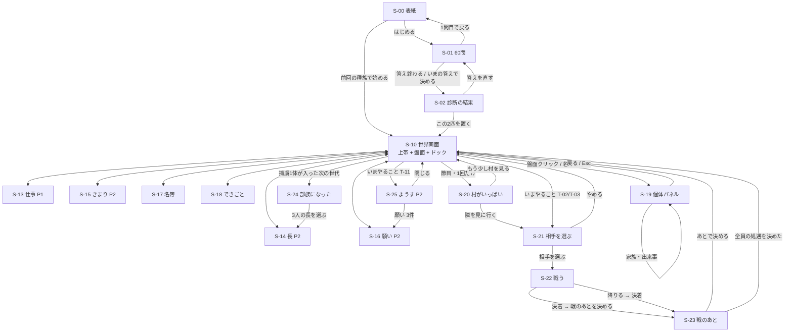

# 12 設計：画面仕様（UI班）

対象：`game/index.html` / `game/style.css` / `game/src/ui/**`
前提：PCブラウザのみ。横 **1280px 以上**（R-934）。文字入力なし、すべてクリック（R-901）。
1画面に1つの用件（R-904）。難解な日本語を書かない（R-905）。

この文書は **「どの画面に何が出て、何が押せて、何が出てはいけないか」** だけを決める。
- 言葉の中身（やさしい表示名・説明文の文面）は **用語班（11）** の辞書に従う。この文書は「どこにホバー説明が要るか」だけを決める。
- ホバー説明の実装（`bar()` の hint 引数・CSS・出し方）は **デザイン班** の仕組みに従う。
- 盤面の中身（畑・狩り場・訓練場・中心・辺境の描き方）は **村マップ班** に従う。この文書は「盤面が画面のどこを占め、何を返すか」だけを決める。
- `sim` の値の出し方は **adapter班** に従う。この文書は「画面が adapter に何を要求するか」を §13 にまとめる。

---

# 1. 決めたこと（先に結論）

| # | 決定 | ひとこと理由 |
|---|---|---|
| **1** | **骨格は維持する**（上帯／左・盤面／右・ドック／個体／モーダル）。ただし**個体パネルの置き場所だけ変える** | スコープを場所で分ける今の判断は正しい。壊れているのは中身と嘘の文言であって骨格ではない |
| **2** | **個体パネルは盤面を覆わない。** ドック（右）の手前に重なる層にする | 村がマップになる以上、盤面は情報面。覆ったら見えない個体をクリックできない（04-3-3） |
| **3** | **タブはフェーズで増える。** P1は3枚、P2は5枚 | 道具は1フェーズに1〜2個ずつ配る（R-922）。P1に「きまり」「願い」を出すのは仕様違反（局が無い） |
| **4** | **上帯は7項目→5項目。**「国の強さ」と「いま（フェーズ）」を外す | 「国の強さ」は個体の「強さ」と名前が衝突していた（04-2-4）。相手を選ぶ場面でしか意味を持たない |
| **5** | **人口は必ず「N / 上限M」で出す。** 固定文に数字を書かない | 「10体で止まります」と言いながら13体になる（04-2-1）は、**画面が固定文を持っていたこと**が原因の半分 |
| **6** | **モーダルの幕は上帯も覆う。**幕がある間、世界は必ず止まる | 決断待ちの裏で時間が進むのを止める（04-2-5） |
| **7** | **モーダルは同時に1枚だけ。**2枚目はキューに積む | モーダルの上にモーダルが積める状態を潰す |
| **8** | **報告（ようす）は自動で開かない。** 「いまやること」の行から開く | 世代ごとに割り込むモーダルは用件ではない（04-2-7） |
| **9** | **止まる画面には必ず「あとで決める」がある。**戦闘中を除く | 国境で詰む（04-13-1）を構造から消す |
| **10** | **モーダルは先に開く。中身の計算は開いたあと、必ず try で包む** | `captiveOptions()` が投げると画面が1枚も無い停止状態になる（04-13-1）。開いてから落ちれば、少なくとも「進む」ボタンが残る |
| **11** | **上帯に「⏭ 次の世代へ」を足す** | P2の1世代60分（04-2-6）に、UI側からできる唯一の手当て |
| **12** | **戦闘は自動で止まる場面を持つ。** 団結が折れかけたら一時停止して降伏を聞く | 4秒で終わって唯一の判断が出せない（04-12-3） |
| **13** | **押せないボタンは出さない。** 「押せるが何も起きない」を全画面から消す | 04-13-2 / 6-3 / 12-8 / 10-1 が同じ形のバグ |
| **14** | **開発用UIは `?dev=1` のときだけ、上帯右端の1か所にまとめる** | 開発物が本番に散っている（04-0-5） |

---

# 2. 骨格

## 2-1 割り付け（1280px）

```
┌──────────────────────────────────────────────────────────────┐ 上帯 h=56
│ 増殖  [第4世代][人口 8/10][食べもの あと6世代][民心 62][うらみ 4]  経過 3:12  ⏸ ×1 ×2 ×4 ×8  ⏭ │
├─────────────────────────────────────────┬────────────────────┤
│                                          │ いまやること        │ ドック
│           盤 面（村マップ）               │ ┌────────────────┐ │ w=380 固定
│           〜 900px                        │ │ 3体が何もしてい │ │
│                                          │ │ ない            │ │
│  ┌ 凡例(左下)          トースト(右下) ┐   │ └────────────────┘ │
│                                          ├────────────────────┤
│                                          │ 仕事 | 名簿 | できごと│ タブ
│                                          ├────────────────────┤
│                                          │                    │
│                                          │  タブの中身         │
└─────────────────────────────────────────┴────────────────────┘
```

- 上帯 56px 固定。盤面はのこり全部（横 `1fr`）。ドック 380px 固定。
- 1280px のとき盤面は約 900×744。1440px でも 1920px でもドックは 380px のまま。**盤面だけが広くなる。**
- **個体パネルはドックと同じ 380px の枠に重なる**（`position:absolute; inset:0` on `#dock`）。盤面には一切かからない。

## 2-2 スコープは3つ。場所で分ける

| スコープ | 置き場所 | 見出し | 何を扱うか |
|---|---|---|---|
| **世界** | 上帯 | （見出しなし） | 時間・全体の数値。**読むだけ。行動ボタンを混ぜない** |
| **国ぜんたい** | 右ドック | `▪ 国ぜんたい` | いまやること・タブ5枚 |
| **一体だけ** | ドックに重なる層 | `◂ この一体だけ` | 個体パネル |

同じ見た目で違うスコープを並べない、という今の判断（`main.js` 冒頭のコメント）は維持する。
個体パネルはドックと **同じ場所に重なる**（＝並ばない）ので、スコープの分離は保たれる。

## 2-3 いまの骨格から変える4点

| 変更 | 前 | 後 | 理由 |
|---|---|---|---|
| 個体パネルの位置 | 盤面の左半分に被せる | ドックに重ねる | 04-3-3。盤面がマップになるので絶対に覆えない |
| 幕の範囲 | `top:60px`（上帯は覆わない） | `top:0`（全部覆う） | 04-2-5 |
| タブの枚数 | P1もP2も5枚 | P1は3枚、P2は5枚 | R-922 / 04-6-5・9-1 |
| 上帯の項目 | 7項目 | 5項目＋時計＋速度＋⏭ | 04-2-2・2-3・2-4 |

---

# 3. 上帯（S-10 の一部）

**この画面の用件**：いま世界がどうなっているかを、目を動かさずに読む。

## 出す情報（5項目。左から固定順）

| 項目 | 表示 | 出どころ | ホバー説明に書くこと |
|---|---|---|---|
| 世代 | `第 4 世代` | `w.gen` | 時間の単位。年は無い。1世代で全員が1つ歳を取る |
| 人口 | `8 / 10 体` ＋ 段階名（村／部族） | `w.people.size` / `api.popCap(w)` | 分母は「この段階の村が抱えられる数」。超えた分は取り分が減るだけ |
| 食べもの | `あと 6 世代ぶん` ＋ 矢印（↑増える ↓減る →横ばい） | `w.food` / `w.consumption` | 在庫を「何世代もつか」に直したもの。矢印は作る量と食べる量の差 |
| 民心 | `62`（0〜100） ＋ 段階名 | `w.morale` | 低いと働きが落ち、願いが荒れ、逃げやすくなる |
| うらみ | `18`（0〜100） ＋ 段階名 | `w.regimeGrudge` を 0〜100 に直す | 国そのものへの恨み。高いと謀反と一揆が出る。死んでも家系に残る |

**書式の規則（全画面共通）**
- 画面に出る数は **0〜100の整数** か **`N 体` `第N世代` `あとN世代`** のどれかだけ。
- **小数を出さない。**`0.65` `7.93` `17.00` は禁止（04-4-6 / 10-5）。
- 割合には必ず `%` を付けるか、0〜100の素の数に段階名を添える。**同じ量を片方で `65%`、片方で `0.65` と書かない。**
- 数値と、その横の形容（増えている／ぎりぎり）は **必ず同じ量を指す**（04-2-2）。食べものを「在庫の数」で出して形容を「産出比」で作る、をやめる。

## できる操作（右側）

| 操作 | 挙動 |
|---|---|
| `⏸ 止める` / `▶ 進める` | 世界の時計を止める・動かす |
| `×1 ×2 ×4 ×8` | 倍率。ホバー説明は「ふつうの速さの◯倍」（「設計値」と書かない：04-0-2） |
| `⏭ 次の世代へ` | いまの世代が終わるところまで一気に進める。押している間だけ早送り、終わったら元の速さに戻る |
| 経過 `3:12` / `1世代 0:45` | 読むだけ |

## 出てはいけないもの

- **「国の強さ」**（→ S-21 と S-25 に置く）。個体の「強さ」と同じ画面に並ぶと、国より個人が強いと読める。
- **「いま：村／部族」の独立項目**（→ 人口の欄に併記）。
- 行動のボタン（戦いに行く・報告を読む）。上帯は読むだけの帯。
- 生の小数（`国への恨み 0.3`）と、数字と食い違う形容（`0.3` なのに「なし」：04-2-3）。
- `sim` / `mock` バッジ（`?dev=1` のときだけ。ただし**mock で動いているときは本番でも `にせデータで動いています` と文字で出す**。壊れたビルドを黙っていてはいけない。**色だけで知らせない**：A-5）。

---

# 4. 盤面（S-11）

**この画面の用件**：いま誰がどこにいて、どの血すじで、どれだけ育っていて、**どれが弱っているか**を見る。

**出す情報**：場所の描き方は村マップ班（`14`）に、個体の記号は `07-A-4` / `A-5` と `13-設計-個体の記号.md` に従う。
UI班はこの表を勝手に増やさない。**増やすときは色以外のチャンネルで**（A-5 の絶対規則）。

### 盤面に描く記号（差し替え後）

| 見えるもの | 意味 | 決めた場所 |
|---|---|---|
| 円の**大きさ** | **年齢**（育つほど大きい）。人口による全体倍率は**段でしか動かない** | 13 §3-2 / §9-2 |
| 体の外側の**年輪**（同心の細線） | **年齢**（2歳ごとに1本・最大4本）。いちばん外の輪だけ太いのが「老い」 | 13 §3-3 |
| 体の中の**細胞（丸）の数** | **熟練**（腕が伸びた分だけ増える）。**数えられることが生命線** | 13 §4-2 |
| **色相**（色あい） | **血すじ。これだけ。**混血は楔（扇形）に分かれ、**切れ目の本数＝血すじの本数** | 13 §5 |
| **暗さ（明度）** | **弱っている度合いだけ**（ケガ・疲れ、戦闘中は恐怖）。**内訳は言わない** | 13 §6 |
| 色が抜けていく | 死んだ・出ていった（0.6秒で無彩色へ） | 13 §14-1 |
| 位置（角度／半径） | どの仕事か／まんなかに住むか村はずれに住むか | 14 §3 |
| 二重円（ハロー） | ホバー・選択。**状態ではなく操作の反応** | 13 §14-2 |

**盤面に出してはいけない記号**（撤廃済み。実装からも消す）

- **目**（縦長の楕円2つ）。感応も恐怖も目では表さない（A-4 が名指しで撤廃）。`color.js` の目の描画ごと消す
- **彩度＝熟練**（`color.js:94` `52 + 46*training`）。熟練は**細胞の数**へ移った
- **明度＝年齢**（`color.js:84` `70 - 42*t`）。年齢は**大きさと年輪**へ移った
- **金の輪＝長／白の輪＝よそ者**（`dish.js:194`）。輪は年輪と衝突する。長とよそ者は**アイコン**で言う（A-5）
- **崩壊で線を赤にすること**（`dish.js:156`）。二重線＋内側破線に置き換える（15 §4-1・14 §4.2）
- **色で状態・所属・役割・警告を言うこと全部。**「危ないから赤」を盤面に一行も作らない（A-5 の絶対規則）。
  理由は実装上も正しい：血が混ざるほど色相は中間色へ寄るので、**後半はどの個体も似た濁った色になる**

**内訳は盤面では言わない。**盤面は「ただごとではない（暗い）」だけを伝え、
何の状態かは押した先の S-19 でアイコンが名指しする（A-5 の二層）。この順番を崩さない。

UI班として決めるのはこの5つだけ。

| # | 決めごと |
|---|---|
| **P-1** | **クリック判定は円の半径から作る**（`max(半径+6, 14)px`）。固定22pxをやめる。同距離に複数いたら最も近い1体（04-3-4） |
| **P-2** | **背景クリックで選択を解除する**（04-3-5）。`Esc` でも解除 |
| **P-3** | **凡例は盤面の左下、トーストは右下。**重ねない（06 追記）。凡例には盤面に描かれている**すべての記号**の意味を載せる。読めない記号を1つも残さない（04-3-2）。**載せるのは上の表の8行 ＋ 14 §1 の場所8件。**撤廃した記号（目・濃さ＝熟練・金/白の輪）を凡例に残さない。**数えるもの（年輪・細胞）は実例の絵を描いて出す**（「4個」と書くだけにしない） |
| **P-4** | **ホバー名札は必ず画面内に収める。**上端で切れない（04-3-6）。名札には `名前・歳・いまの仕事` の3つだけ。**同じ名前が2つ以上見えているときは血すじ名を括弧で足す**（`アダム（アガルタ）`。`13 §13`）。10国とも創世の2体が「アダム」「イザナミ」で、捕虜として同名が村に入る（N-8 と同じ規則） |
| **P-5** | **個体パネルが開いているあいだ、その個体を盤面で光らせる。** どれを見ているかが分からなくならないように |

**出てはいけないもの**
- 意味が凡例に載っていない図形（04-3-2 の多角形と三角）。
- 盤面を覆う他のパネル（04-3-3）。
- 人口と描画数の食い違い（06-3：人口6なのに2体しか描かれない／06-7：人口20なのに2体）。**盤面は `w.people` を全件描く。**

---

# 5. ドック

## 5-1 いまやること（S-12）

**この画面の用件**：次に押すべきボタンを1つに絞る。この箱がドックの主役。

### 出し方の規則

- **3行構成**：`見出し（いま何が起きているか。必ず数を入れる）` / `理由（放っておくとどうなるか）` / `ボタン（動詞ひとつ）`
- **見出しは必ず世界の値から作る。固定文に数字を書かない。**
- **ボタンの名前と、飛んだ先の画面の見出しは同じ言葉にする**（04-2-8：ボタンは「戦いに行く」なのにトーストは「隣のシャーレへ」）。
- 表示は **最大3件**。4件目以降は `ほかに 2 件` と畳む。
- 用件がゼロのときは **「いまは無い」で終わらせない。**「次に何が起きるか」を1行で出す（例：`あと 2 体で村がいっぱいになる`）。

### 一覧（上から優先）

| id | 条件 | 見出し（例） | 理由 | ボタン → 行き先 |
|---|---|---|---|---|
| **T-01** | `borderQueue.length > 0` | `連れ帰った 1 体の行き先が決まっていない` | 受け入れる・返す・殺すのどれか。決めるまで戦は終わらない。 | `決める` → S-23 |
| **T-02** | 初戦の合図が立っている | `村がいっぱいになった（12 体 / 上限 10 体）` | これ以上は増えない。増やすには、よそから血を1体連れてくるしかない。 | `隣を見に行く` → S-21 |
| **T-03** | 戦えて、初戦ではない | `隣の国が見えている` | 勝っても負けても、相手から人を連れ帰れる。 | `隣を見に行く` → S-21 |
| **T-04** | 戦えない（冷却中） | `あと 1 世代は戦えない` | 前の戦の傷が癒えていない。 | （ボタンなし） |
| **T-05** | P2・空席の局あり | `2 つの局に長がいない` | 長のいない局は、報告も願いも出さない。 | `長を選ぶ` → S-14 |
| **T-06** | P2・未処理の願いあり | `3 件の願いが届いている` | この世代のうちに決めないと、長が自分で決めてしまう。 | `1件ずつ読む` → S-16 |
| **T-07** | `collapsing` | `飢えて死にはじめている` | 作る量が足りない。畑に回す人を増やす。 | `仕事を見直す`（P1）/ `きまりを見直す`（P2） |
| **T-08** | 産出 < 消費 | `食べものが減っている（あと 3 世代ぶん）` | 尽きる前に畑を増やせば戻る。 | 同上 |
| **T-09** | 人口 > 上限 | `人が多すぎて、ひとりの取り分が減っている` | 増えるほど1人あたりが痩せる。 | `名簿を見る` → S-17 |
| **T-10** | P1・無役がいる | `3 体が何もしていない` | 無役は食べるだけで何も作らない。 | `仕事をわりふる` → S-13 |
| **T-11** | P2・未読の報告あり | `第 12 世代の報告が届いている` | 3人の長が、何が起きたかを言ってきている。 | `ようすを読む` → S-25 |

**出てはいけないもの**
- 固定文の数字（`村は10体のまま止まる` — 上限は世界から読む）。
- P1 での「報告を読む」ボタン。**P1に報告という概念は無い**（R-111 / 04-9-1）。
- 押しても何も起きない行（04-小：`決める` が国境画面を開き直さない）。**T-01 の `決める` は必ず S-23 を開き直す。**

## 5-2 タブ構成

**フェーズで枚数が変わる。**左ほど「押す」、右ほど「読む」。

### P1（村）＝3枚

| 並び | タブ | この画面が答える問い | 対応する動詞 |
|---|---|---|---|
| 1 | **仕事** | 誰に何をさせるか | 置く |
| 2 | **名簿** | 探している1体はどこにいるか | 読む |
| 3 | **できごと** | いま何が起きたか | 読む |

### P2（部族）＝5枚

| 並び | タブ | この画面が答える問い | 対応する動詞 |
|---|---|---|---|
| 1 | **長** | 3つの局を誰に任せるか | 置く |
| 2 | **きまり** | 自分が見ていない間、どう動くか | 敷く |
| 3 | **願い** | この求めを通すか、断るか | 裁く |
| 4 | **名簿** | 探している1体はどこにいるか | 読む |
| 5 | **できごと** | なぜこうなったか | 読む |

**並び順の理由**：解禁される順（置く → 敷く → 裁く）に左から並べる。初見は左から順に押すので、覚えた順と並び順が一致する。「読む」2枚は常設なので右端に固定する（P1でもP2でも同じ位置にある＝場所を覚え直さなくてよい）。

**タブのバッジ**：未処理の数だけを出す（無役の数／空席の数／未処理の願いの数）。ゼロなら出さない。

**出てはいけないもの**
- P1 での「きまり」「願い」タブ。**P1に局は無い。**「団結が◯%を切ったら降伏を進言」というカードが局のいない村に出るのは破綻（04-6-1）。
- 「まだ使えない」と書かれた押せるボタン（04-6-5 / 9-2）。**まだ使えない動詞は「きまり」タブの最下段に、ボタンではない灰色の行として並べるだけ。**

---

# 6. 画面ごとの仕様

書式：**用件 / 出す情報 / できる操作 / 出てはいけないもの**

## 画面の索引（全20枚）

| id | 画面 | 書いてある場所 | 種類 |
|---|---|---|---|
| S-00 | 表紙 | §6 | 全画面 |
| S-01 | 60問（診断） | §6 | 全画面 |
| S-02 | 診断の結果 | §6 | 全画面 |
| **S-10** | **世界画面（シェル）** | §2・§3（上帯）・§5（ドック） | 常設 |
| S-11 | 盤面（村マップ） | §4 | 常設・左 |
| S-12 | いまやること | §5-1 | 常設・ドック上段 |
| S-13 | タブ「仕事」（P1） | §6 | タブ |
| S-14 | タブ「長」（P2） | §6 | タブ |
| S-15 | タブ「きまり」（P2） | §6 | タブ |
| S-16 | タブ「願い」（P2） | §6 | タブ |
| S-17 | タブ「名簿」 | §6 | タブ |
| S-18 | タブ「できごと」 | §6 | タブ |
| S-19 | 個体パネル | §6 | ドックに重なる層 |
| S-20 | 節目「村がいっぱいになった」 | §6 | モーダル・1回 |
| S-21 | 相手を選ぶ | §6 | モーダル |
| S-22 | 戦う | §6 | モーダル |
| S-23 | 戦のあと（国境） | §6 | モーダル |
| S-24 | 節目「村が部族になった」 | §6 | モーダル・1回 |
| S-25 | ようす（報告・P2） | §6 | モーダル |
| S-90 | 開発用パネル | §6 | `?dev=1` のみ |

---

## S-00 表紙

**用件**：始める。

**出す情報**
- タイトル。1行の説明（「2匹から始めて、増やして、隣とぶつける」程度）。
- 前回の種族があれば、その **名前・6軸の読み・危うさの1行**（コードだけを出さない：04-1-8）。

**できる操作**
- `はじめる（60問に答える）`
- `前回の種族で始める`（保存があるときだけ）
- `前回の種族を捨てる`（保存があるときだけ。確認を1回）

**出てはいけないもの**
- `?dev=1` でないときの「60問を飛ばす」入口。
- 6文字コードだけの表示（何のことか分からない）。

---

## S-01 60問（診断）

**用件**：60問に答える。

**出す情報**
- 問題文1つ。7段階の点。`24 / 60`。
- **6軸の名前を最初から出す**（04-1-3 / 06-1）。下の6本の帯には、答える前から軸の名前が入っている。
- 各軸の帯は、いまどちらへ寄っているかを示す。**染色体番号は出さない。**
- `1〜7 キーでも答えられる` を画面に書く（04-1-9）。

**できる操作**
- 7段階のどれかを押す（＝次の問へ）
- `← 戻る`（1問目でも押せる形にする。押すと S-00 へ戻る：04-1-2）
- `いまの答えで決める`（30問目以降に出す。残りは中央として扱う旨を書く）

**出てはいけないもの**
- 離脱手段のない状態（1問目の「戻る」を `visibility:hidden` にしない）。
- 何の軸を測られているか分からない状態。

---

## S-02 診断の結果

**用件**：この種族で始めるかを決める。

**出す情報**
- 種族名と、その読み（6軸のやさしいラベル）。**染色体番号を出さない**（04-1-4 / 06-2）。
- 6軸それぞれ：軸の名前・どちらに寄ったか・**「高いとゲームで何が起きるか」1〜2行**。
- 「危うさ」1行（今ある文章の密度がちょうどよい。他の全項目をこの密度に揃える）。
- 最初の2匹のカード。**数値の ± を出すなら必ず「何に対しての ±か」と「高いと何が起きるか」を添える**（06-2）。添えられないなら数値を出さない。

**できる操作**
- `この2匹を置く`（＝開始）
- `答えを直す` → **どの問から直すかを選ばせる**（軸ごとに「この軸の問だけ見直す」）。60問目に飛ばさない（04-1-1）
- `もう一度ぜんぶ答える`

**出てはいけないもの**
- **スクロールしないと押せない開始ボタン**（06-2）。開始ボタンは常に画面の下端に固定して置く（`position:sticky`）。
- `4番` `8番` などの内部番号。同じ番号が2回出る状態。
- 意味の定義されていない `57%`（04-1-5）。出すなら「どれくらい強く寄っているか」の段階名（弱い／ふつう／強い）にする。
- **この画面を開いただけで前回の種族を上書きする挙動**（04-1-7）。保存は `この2匹を置く` を押したときだけ。

---

## S-13 タブ「仕事」（P1のみ）

**用件**：誰をどこに置くか決める。

**出す情報**
- 置き場所ごとのカード：**畑 / 狩り場 / 訓練場**、そして **中心 / 辺境**（住む場所）。
  - カードには「いま何人いるか」と「**そこにいる全員の名前**」（04-5-5）。人数だけにしない。
  - 各カードのホバー説明に「ここに置くと何が伸びるか・何が作られるか」。
- **子どもは別枠で出す。**「まだ働けない ◯ 体」として名前を並べる。
  → 人口6なのに仕事タブに2体しか出ない（06-3）を消す。**仕事タブに出る人数の合計は必ず人口と一致する。**
- 無役がいれば、カードの上に警告行（`3 体が何もしていない`）。

**できる操作**
- 名前を押す → 選ぶ（選ばれた名前は光る）→ 置き場所の `ここへ置く` を押す
- 個体パネルからの1クリック配置も**同じ操作にそろえる**（04-5-7）。**操作方式は1つだけ。**
- 選択の解除（`Esc` / 背景クリック / もう一度同じ名前）

**出てはいけないもの**
- **「無役」という置き場所**（04-5-6 の前段。無役は状態であって行き先ではない）。同じ画面で「無役はダメだ」と言いながら無役に置かせない。
- **sim が対応していない置き場所**。村で訓練場に置いても効かないなら、訓練場は置き場所として出さない（04-中：模擬戦の割合が村では0固定）。**「置けるが何も起きない」を作らない。**
- 同じ名前のボタンが3つ（04-5-6）。ボタンは `畑へ置く` `狩り場へ置く` `訓練場へ置く` と行き先を名乗る。
- 一度置いたら戻せない状態。**置き直しは常にできる。**

---

## S-14 タブ「長」（P2のみ）

**用件**：3つの局に、それぞれ長を1人ずつ置く。

**出す情報**
- 局は3つ（軍務・農業・民生）。局ごとに1枚のカード。
  - 空席なら `長がいない`（言い方を1つに統一：04-用語）。
  - 在席なら 名前・歳・出身（自国／どこの国から来たか）・**任命してからの世代数**。
- 候補リスト（1局につき）：
  - **並び順の根拠を必ず表示する。**「強い順」に並べるなら各行に強さを出す（04-5-2）。
  - 各行に **出身**（よそ者なら国名）を必ず付ける（04-5-3）。同名の2体が区別できない状態を作らない。
  - 各行に **知性 × 野心** の2軸だけを大きく出す（R-341）。ほかの遺伝子を並べない。
- 任命したときのリスク1行。**候補リストの注記と、任命後の注記で逆のことを言わない**（04-5-4）。

**できる操作**
- 局を選ぶ → 候補を選ぶ → `この者を長にする`（確認モーダル1回。前任者がいるなら「前の長は恨む」と書く）
- `長を外す`（確認1回）

**出てはいけないもの**
- **同一人物を2つ以上の局の長にできる状態**（04-5-1）。他局の長は候補リストから外す。どうしても兼任させるなら、確認モーダルで「いま軍務局長でもある。外して移すか」を聞く。
- 並び順の根拠が画面に無い状態。
- 出身の付かない候補行。

---

## S-15 タブ「きまり」（P2のみ）

**用件**：自分が見ていない間の動き方を決める。

**出す情報**
- 一番上に要約行：`いま効いているきまり 3 枚 / 12 枚`（04-6-4：全部オフなのに何も言わない、を消す）。
- カード1枚 ＝ `名前` `オン/オフ` `数値` `1行の説明` `ホバー説明（この数字を上げると何が起きるか）`。
- **カード名にプレースホルダの `N` を出さない**（04-6-1）。名前は「上位◯%を派遣」ではなく、いまの値を入れた文にする（`上位 30% を派遣`）か、名前と数値を分ける。
- 数値には単位を付ける。**このゲームに存在しない単位（「日」）を出さない**（05-小）。
- 最下段に **まだ使えない手**：配る・殺す・ぶつける・編む を、ボタンではない灰色の行として並べ、それぞれ1行で「何をする手か・いつ使えるようになるか」。

**できる操作**
- トグル（オン/オフ）
- スライダー ＋ ステッパー（`−` `＋`）

**出てはいけないもの**
- **スライダーとステッパーが別の値を持つ状態**（04-6-2）。両者は同じ1つの値を見る。値を変えたら両方が同時に更新される。
- **オフのカードのステッパーが押せる状態**（04-6-3）。オフのときは数値の操作をまとめて無効にする（見た目も無効にする）。
- 「まだ使えない」と書いてあるのに押せるボタン。
- `N` `◯` のまま画面に出る文字。

---

## S-16 タブ「願い」（P2のみ）

**用件**：いま来ている願いを1件ずつ、通すか断るか決める。

**出す情報（1件ずつ。既定で一覧にしない）**
- `3 件のうち 1 件目`
- 誰が言っているか（名前・局・出身・任命からの世代数）
- **何をしてほしいか**（やさしい日本語1文）
- **なぜ言うのか**：遺伝子の数値を並べない（04-7-2）。**「この人はこういう人だから、こう言っている」の1文**にする。数値を添えるなら文のあとに小さく、ホバー説明つきで。
- **通したらどうなるか / 断ったらどうなるか**：それぞれ1〜2行。**どちらにも損が書いてある**こと（R-331：無害な選択が存在しない）。
- **期限**：`この世代のうちに決めないと、長が自分で決める`（R-342 / 04-7-4）

**できる操作**
- `通す` / `断る` / `次を見る（あとで決める）`
- `まとめて見る`（一覧に切り替え。比べたい人向け。既定ではない）

**出てはいけないもの**
- 古文（具申・讒言・叙勲要求・慰撫・不審の廉あり・名誉を賭けて糾弾・称号を賜りたい）。用語班の辞書で全文差し替える（04-7-1）。
- 画面のどこにも定義されていない量（`序列が下がる`：04-7-3）。
- **解決したのに残り続けるカードと、二度押せるボタン**（04-10-1）。1件処理したら必ずその場で描き直す。
- **v2で使えないはずの動詞が裏で動くこと**（04-7-5：願いを通すと予算が動くのに、予算はどの画面にも出ない）。予算が動くなら、動いた結果を「ようす」に必ず出す。出せないなら、その願いを v2 に出さない。

---

## S-17 タブ「名簿」

**用件**：条件で人を探す。

**出す情報**
- 行 ＝ `名前 / 歳 / いまの仕事 / 出身 / 並べ替えに使っている値`。
  - **並べ替えに使っている値だけを、行の右に出す。**「若い順」なのに歳が2回出る（04-8-1）をやめる。
- 絞りこみ：生きている／死んだ、歳の範囲、仕事、出身、素質のしきい値。
- 絞りこみは **開いていなくても、いま効いている条件を1行で出す**（`いま：生きている・0〜60歳`）。04-8-3（既定で41歳以上が消える）を消す。
- 素質のしきい値に出す遺伝子名には、必ずホバー説明を付ける（04-8-4）。

**できる操作**
- 行のホバー → 盤面でその個体が光る
- 行のクリック → 個体パネル（S-19）
- 絞りこみ・並べ替え

**出てはいけないもの**
- 状態のトグルと動作のボタンが同じ見た目で同じ列に並ぶこと（04-8-2）。動作は左、状態は右、と場所で分ける。
- 黙って行を消す既定の絞りこみ。

---

## S-18 タブ「できごと」（年代記）

**用件**：何が起きたか、そして**なぜそうなったと言われているか**を読む。

**出す情報**
- 世代ごとにまとめた出来事の一覧。1行 ＝ `いつ / 何が起きたか / 誰が関わったか`。
- **戦の行には勝敗を書く**（04-9-3：「崩壊で終わった」では勝敗が読めない）。
- P2からは、事件に **「◯◯局長はこう言っている」** の帰属が付く。**P1では付かない**（局が無いので）。
  → 04-9-1（村なのに「ここに並ぶのは長が言ったことだけ」）はこれで消える。
- 絞りこみ：`生き死に` `戦` `仕事と暮らし` `もめごと`。**「発現」を「生き死に」に入れない**（04-9-4）。

**できる操作**
- 絞りこみ
- 行のクリック → その事件に関わった個体（S-19）へ

**出てはいけないもの**
- **「編む」（本当のことを決める）ボタン**。P3の動詞で、v2には無い（R-911 / 04-9-2）。
- 中身を見ないで貼られる固定文（`調査の結果、責任は内側にあった`）。
- 専門用語のままの事件名（`潜伏形質の発現` `戦終`）。用語班の辞書を通す。

---

## S-19 個体パネル「この一体だけ」

**用件**：この1体が何者かを知る。

**置き場所**：ドックに重なる層（380px）。盤面は覆わない。

**出す情報**
1. **肖像**（盤面と同じ体。核＝細胞・年輪帯・外周線の3層。**目は描かない**）・名前・歳・いまの仕事・住んでいる場所・出身（よそ者なら国名）
   - 肖像のすぐ下に **状態アイコンの行**（`13 §11`）。**A-5 の「内訳はここで名前が付く」層は、この1行のこと。**
     いま立っている状態だけを出す：ケガ／恐怖（戦闘中）／疲れ／不満／国への恨み／老い／よそから来た／子がいる／
     まだ開いていない才能／席5種（畑・狩り・訓練・無役・出撃中）／住まい2種／長3種／名指しで置いた。
   - 並びは **C群（長）→ A群（体の状態）→ B群（席）→ D群（オーナーがした事）** で固定（`13 §11-4`）。
     順が固定なら、位置そのものが手がかりになる。
   - **アイコンは白黒（`currentColor` 1色）。色で意味を分けない**（A-5）。画像素材を使わず、コード内のインライン SVG で描く。
   - **アイコン1つずつにホバー説明を付ける。**アイコンのキーは用語班の辞書のキーと**同じ文字列**にする（欠-33。辞書が2つに割れる）
2. **いまの調子**：強さ／熟練／疲れ／不満 の4タイル。
   - **危険域を色で言わない**（A-5）。数字の横に**段階名**を出し（`不満 82 / 危ない`）、
     同じことを1の**アイコン行**が言う。`inspector.js:194` の `tile()` に段階名の引数を足す
     （`style.css` の `.tile.alarm` は誰も付けないので死んでいる：04-4-5。**赤くするのではなく、段階名とアイコンで直す**）
   - **熟練のタイルには、盤面で数えられる丸の数を必ず併記する**（`熟練 29 ・ 丸3個`）。
     盤面の記号と個体詳細の数字が**同じものを指している**ことが、これで初めて分かる（A-1）
3. **練度（伸びるもの）** 5軸。「これは育つ」と見出しに書く
4. **素質（生まれつき）** 33座位。「これは変わらない」と見出しに書く
   - **未発現はレンジ表示**（`?? 推定 70〜90`）。確定値を出さない（R-804）
   - **すべての項目にホバー説明**（R-933）。説明には「高いと何が起きるか」を必ず書く
   - **sim が読んでいない座位（感応・世代間伝承意欲・懐疑）は、他と同じ見た目で並べない。** 出すなら「いまは効かない」と明記した別枠。出さないのが望ましい（05-致命）
   - **実装されていない効果を書かない**（05-致命：「感応＝気配に気づく力」）。事実は常に正確に見える（R-009）
5. 家族（親・子・きょうだい）。名前を押すとその個体へ
6. この個体に関わる出来事（最大5件）→ 押すと「できごと」へ

**できる操作**
- `◂ 戻る`（＝閉じる）。`Esc` でも閉じる
- P1：仕事の割り当て（S-13 と同じ操作方式）
- 家族・出来事へのジャンプ

**出てはいけないもの**
- **同じ項目が2回出ること**（04-4-1：統率素質が「こころ」に2回）。33座位は1回ずつ、決まった順で出す
- **同じ性質のものが2つのグループにばらけること**（04-4-2）。「幼少期に開く6つ」は6つまとめて1か所
- **その画面で実行できない指示**（04-4-3：P2で「畑に置くと開く」と書く）。指示を書くなら、その操作が同じ画面にあること
- 人口2で `上位 1%`（04-4-4）。母数が小さいときは順位を出さず `2体中1番目` と書く
- 単位の説明がない `歳`（04-4-7）。歳は「生きた世代の数」。ホバー説明で必ず言う
- **目を描くこと**（A-4 で撤廃）。肖像は盤面と同じ体で描く。**盤面と個体詳細で違う絵を出さない**
- **実装に無い状態のアイコン**（妊娠・飢え・病）。妊娠している期間は sim に存在せず（`world.js:773`）、
  飢えは個体ではなく国の状態（`world.collapsing`）。代わりに「子がいる」を出し、飢えは上帯に出す（`13 §11-1`）
- 盤面を覆うこと

---

## S-20 節目「村がいっぱいになった」（モーダル・1回だけ）

**用件**：先へ進む道が戦いだけになったことを伝える。

**出す情報（すべて世界から読む。固定文の数字を1つも書かない）**

| 出す値 | どこから |
|---|---|
| いまの人口 と 上限 | `w.people.size` / `api.popCap(w)` |
| 出す顔ぶれの数（`5 対 5`） | `api.warPreview(w)` の実値。相手が5人いないなら、その数を正直に出す |
| 連れ帰る数 | `api.captivePreview(w)` の実値 |
| 勝っても負けても連れ帰れること | 固定文でよい（ルール） |

**できる操作**
- `隣を見に行く` → S-21
- `もう少し村を見る` → 閉じる。**閉じたあとトーストで別名を出さない**（04-2-8）。「いまやること」に T-02 が残ることだけを言う

**出てはいけないもの**
- **`村は10体で止まります` の固定文**（04-2-1 / 06-4）。上限は世界から読み、いまの人口と一緒に出す。
- **`規模 5対5` の固定文**（03-致命：宣言直後に 15対2 になる）。
- 2回目以降の表示。

---

## S-21 相手を選ぶ（モーダル）

**用件**：どの国と戦うかを1つ選ぶ。

**出す情報**
- **自国の行を一番上に**：`我らの国` ＋ **強さ** ＋ 人口 ＋ 色。
- 相手10国：`国の名前` ＋ **強さ**（自国と**同じ言葉・同じ書式**：04-2-4 / 11-3）＋ `格上／互角／格下` ＋ 色 ＋ **人口**。
  - **人口を必ず出す。**「5対5にならない」の予告になる（03-致命）。人口が5未満の国には `この国は 2 人しかいない。5対2 になる` と行に書く。
  - 色は **色の点だけでなく、色の差の言葉**（`ほとんど同じ色` `かなり違う色`）を添える。10国の色が近いと点だけでは判断できない（04-11-2）。
    色相は**出会った順のラダー**で配る（`13 §8-2`）。ハッシュをやめると、同時に見える先頭5国の最小色差が 11.3 → 17.7 になる。
    それでも**色だけで選ばせない**（血が混ざるほど色は近づく）。判断の主役は言葉と人口。
- リード文は **1枚だけ**（04-11-4）。

**できる操作**
- 相手を1つ選ぶ → S-22
- `やめる`（フッタに必ず置く：04-11-1）

**出てはいけないもの**
- **閉じるボタンが無い状態**（04-11-1）。
- **閉じたら勝手に世界が動き出すこと**。閉じたときは **開く前の止まり方に戻す**（自分で止めていたなら止まったまま）。
- 開発者向けの言葉（`仮の相手`：04-11-5）。相手がいないときは「隣に国が無い。練習の相手と戦う」と書き、その相手が練習用であることを画面に残す。
- 内訳の表示（R-214：通常は国力しか見せない）。内訳は `?dev=1` のときだけ。
- **「いちばん上（弱い相手）を選べ」という助言**（03/02：その助言が最も人のいない国へ誘導していた）。助言を出すなら「人数が近い相手を選ぶと 5対5 になる」。

---

## S-22 戦う（モーダル・閉じられない）

**用件**：5対5を最後まで見届け、途中で降りるかどうかを1度だけ決める。

**出す情報**
- 両軍の名簿（5対5）。**5対5が最初の表示で全員見えること**（04-12-5）。
  - 1行 ＝ `所属マーク ＋ 肖像 ＋ 名前 ＋ 歳 ＋ アイコン ＋ 生死`。**両軍に同じ名前が並ぶので、所属マークを必ず付ける**（04-12-6 / 06-5）。
    **陣営を色で分けない**（P2 では両国の色が近づく）。所属マークは `我` / `敵` の文字と形で付ける。
  - 戦場は10体しかいないので、**肖像は 44px まで大きくしてよい**（`13 §12-4`）。細胞7個・年輪2本まで数えられる。
  - アイコンは **恐怖・ケガ・出撃中** の3つだけ（`13 §12-3` の上限3つ）。
  - **恐怖は「体が暗くなる」と「アイコン」の両方で出す。**戦闘の見どころそのものなので、ここだけ二重にする（`13 §12-4`）。
  - 逃げた者は**体の不透明度を 0.35 に落として後方へ滑らせる**。色は変えない。
  - 名前は他の要素と重ねない（04-12-2：HPバーが名前に重なる）。
- 団結バー（自分／相手）。
  - **バーの色で危険を言わない**（A-5 の絶対規則）。`battle.js:212` の「0.34 を割ったら `#e2604a`」を消す。
    04-12-1 の正体は「自国 hue=0 の塗り（`battle.js:202`）と危険色がどちらも赤」なので、**危険側を色から降ろすことで消える**。
  - 自軍と相手軍の区別は **所属マークと左右の位置**で付ける。**色で区別しない。**
  - バーに**降伏の判断ラインの目盛りを刻む**。割ったら目盛りの位置に印が立ち、下の「止まる規則」が動く。
    「あと少しで折れる」が、色を使わずに形で読める。
  - バーの横に必ず数字と段階名（`団結 82 / しっかりしている`）。**色だけに頼らせない。**
- ログ（誰が何をしたか。所属つき）。
- **決着したら、なぜそうなったかの3行**（誰が最初に逃げたか／それで団結がいくつ落ちたか／何人が続いたか）。
  → 06-5「なぜ負けたか分からない」を消す。これがP1の教育目的そのもの（R-105 ③）。

**できる操作**
- `⏸` / `×1` `×2` / `1ラウンドずつ`
- `降りる（降伏する）` — **押せる条件が満たされているときだけ出す**
- 決着後：`戦のあとを決める` → S-23

**止まる規則**
- **団結が降伏の判断ラインを割った最初のラウンドで、自動的に一時停止する。**
  「降りるか、粘るか」を1行で聞く。これが唯一の判断（R-A8／04-12-3）。
- 1ラウンドは既定 700ms（×1）。全体で最低でも 15〜25 秒かかること。

**出てはいけないもの**
- 決着後も残る `降りる` ボタン（04-12-8）。決着したら消す。
- **UI が世界を直接書き換えること**（04-12-7：`world.food` を UI が引く）。すべて `api` 越し。
- **`requestAnimationFrame` に依存した進行**（06 追記：裏タブで戦闘が止まる）。世界の時計と同じタイマーで回す。
- 賠償が `食料 0 / 人 0` と出て、実際には別の値が引かれること（03-重大）。**画面に出した数字と、実際に引かれる数字が違ってはいけない。**

---

## S-23 戦のあと（国境・モーダル）

**用件**：連れ帰った者を、受け入れるか・返すか・殺すかを決める。

**開き方の規約（ここが一番詰まる）**
1. **モーダルを先に開く。**
2. 開いたあとで `api.captiveOptions()` を **try で包んで**呼ぶ。
3. 投げたら／`axes` が空だったら／捕虜が0体だったら → **「何が起きたか」1行 ＋ `戦を終える` ボタン1つ**の画面にする。**必ず前へ進めること。**
4. フッタには常に `あとで決める` がある。閉じても「いまやること」の T-01 から必ず開き直せる。

**出す情報**
- 勝ったとき：軸を1つ選ぶ（`総合 / 武力 / 知性 / …`）。
  - **軸の名前は個体パネルの名前と同じにする**（04-13-3：武力＝攻撃素質、統率＝統率素質 の対応がどこにも書いていない）。
  - **引ける数は世界から読む。**「1体を連れ帰れる」と言い切って0体になる（03-重大）をやめる。相手を全滅させたら `連れ帰れる者が残っていない` と最初から書く。
- 負けたとき：全プールから抽選。理由を1行（`負けたので選べない`）。
- 引いた個体：`名前 / 歳 / 出身国 / 相手の国での順位（上位◯%）`。
  - **外国人には順位階級しか出さない**（R-743）。実値を出さない。
  - **順位は相手の国の人口で計算されたものであること**（03-重大：自国の人口で計算されていた）。
- **名前の衝突を画面で解く**（04-13-5 / 06-6）：連れ帰った者の名前は必ず `名前（アガルタ）` の形で出す。名簿でも長の候補でも同じ形。

**できる操作**
- `受け入れる` / `返す` / `殺す`（殺す・返すは確認1回。R-918：オーナーの行為はすべて誰かに恨まれる、を確認文に書く）
- `あとで決める`

**出てはいけないもの**
- **軸を選ぶまで閉じられない状態**（04-13-1）。
- **押せない主ボタン**（04-13-2）。軸未選択なら確定ボタンは出さない。
- 空のフッタ帯（04-13-6）。
- ボタンの文言と結果の言葉の食い違い（04-13-4：`上位から引く` → `上位40%`）。**ボタンには「相手の上位から1体を抽選する」と書き、結果には「引けたのは上位40%の者だった」と書く。**

---

## S-24 節目「村が部族になった」（モーダル・1回だけ）

**用件**：**何を失ったか**を伝える（R-303：転換は獲得ではなく喪失として体験させる）。

**出す情報**
- いまの世代・人口（世界から読む。`10体` と固定で書かない）
- **失うもの**：一体ずつ仕事を決める手 →（取り消し線）
- **残るもの**：3つの局に誰を長として据えるか
- これから起きること：外から来た血が入っていること／局長の言うことは歪むが、数字は正確なままであること
- **1世代の長さが変わるなら、変わったあとの実時間と `⏭ 次の世代へ` の存在を書く**

**できる操作**
- `3人の長を選ぶ` → S-14

**出てはいけないもの**
- 固定文の人口（04-2-1 と同じ形）。
- 「奪われる」ことがひと目で分からない書き方。
- 2回目以降の表示。
- **この直後に盤面が壊れること**（06-7：人口20なのに2体しか描かれない）。フェーズが変わったら盤面を作り直す。

---

## S-25 「ようす」（帰還報告・P2のみ・モーダル）

**用件**：留守のあいだに何が起きたかを、3人の長の口から読む。

**この画面の呼び名は1つに固定する。**ボタン・題・見出しで3つの名前を使わない（04-10-6）。

**出す情報（この4つだけ。縦スクロールを出さない）**
1. **3局からの1行報告**（R-803）。局長の性格で歪む。**歪むのは理由と帰属だけ。数字は正確**（R-801）
2. **グラフ3本**：人口・食べもの・民心。**横軸（世代）を必ず描く**（04-10-7）
3. **重大なできごと 最大5件**。`発現` は重大ではない（04-10-3）。戦・死・粛清・謀反・飢餓・任命だけ
4. **`願い 3 件` のボタン** → S-16 へ飛ぶ。**願いをこの画面に埋め込まない**（04-10-1 / 10-2）

**できる操作**
- 閉じる
- 願いへ飛ぶ
- グラフの点にホバー → その世代の数値

**出てはいけないもの**
- **自動で開くこと**（04-2-7）。「いまやること」の T-11 から開く。
- **中に願いを埋め込むこと。**（1画面1用件。かつ、埋め込むと解決後も消えないバグが必ず戻ってくる）
- **オフになっているきまりを引用した抗議**（04-10-4）。引用する前に `on` を見る。
- 生の小数（04-10-5）。
- P1 での存在（R-111）。

---

## S-90 開発用パネル（`?dev=1` のときだけ）

**用件**：開発者が世界を早送りしたり、内訳を覗いたりする。

**置き場所**：上帯の右端に `dev` ボタン1つ。押すと右からパネル。**本番の画面のどこにも開発用ボタンを置かない。**

**入るもの**
- 部族フェーズから開始（デモ）／種の指定／世代を一気に進める
- ロスター10国の内訳表示（R-214 の「デバッグトグル」）
- 60問を飛ばす
- `sim` / `mock` バッジ
- `window.増殖` の露出

**本番から必ず外すもの**
- `main.js.bak` / `inspector.js.bak` を配信ディレクトリから出す
- `mock.js` を無条件 import しない（`?sim=mock` のときだけ動的 import）
- `window.増殖` は `?dev=1` のときだけ生やす
- `src/ui/cards.js`（死にコード）を消すか、sim と id を合わせて生かすか、どちらかに倒す（04-0-6）

---

# 7. モーダルの線引き

## 7-1 止めてよい場面（全部で7つ。これ以外で止めない）

| # | 場面 | 画面 | 何度出るか | 止める理由 |
|---|---|---|---|---|
| 1 | 診断の結果 | S-02 | 開始前 | 世界がまだ無い |
| 2 | 村がいっぱいになった | S-20 | 1回だけ | 進む道が1本に変わる。見逃すと詰まる |
| 3 | 相手を選ぶ | S-21 | 自分で開いたときだけ | 選ばないと戦えない |
| 4 | 戦う | S-22 | 戦のたび | 途中の判断がある |
| 5 | 戦のあと | S-23 | 戦のたび | 決めるまで戦が終わらない |
| 6 | 村が部族になった | S-24 | 1回だけ | 手が1つ奪われる |
| 7 | ようす（報告） | S-25 | 自分で開いたときだけ | 読むことに集中させる |

＋ **取り消せない操作の確認**（長を替える・捕虜を殺す・種族を捨てる）だけは小さいモーダルで1回聞く。

## 7-2 止めてはいけない場面（＝トーストか、ドックの中で出す）

| 出来事 | どこに出すか |
|---|---|
| 誕生・死亡・発現・帰化 | トースト（同じ世代のものは1本に束ねる） |
| 局長が死んだ・空席になった | トースト ＋ T-05 |
| 食べものが減りはじめた | T-08（トーストは1回だけ） |
| 世代が変わった | 上帯の世代番号とバーだけ |
| 願いが届いた | タブのバッジ ＋ T-06 |
| 報告が届いた | T-11 |
| 外来の血が絶えた | トースト |

## 7-3 モーダルの共通規約（全モーダルが守る）

| # | 規約 | 潰すバグ |
|---|---|---|
| **M-1** | **同時に1枚だけ。**幕があるあいだ新しいモーダルを開かない。開こうとしたらキューに積み、閉じたときに次を出す | 04-2-5 |
| **M-2** | **幕は上帯も覆う（`top:0`）。**幕があるあいだ `paused` を強制する。閉じたら**開く前の止まり方に戻す**（自分で止めていたなら止まったまま） | 04-2-5 / 11-1 |
| **M-3** | **モーダルを先に開く。**中身の計算は開いたあと。**必ず try で包む。**落ちたら「ここで何が起きたか」＋前へ進むボタン1つを出す | 04-13-1 |
| **M-4** | **閉じ方が常に2つ以上ある**（`Esc` ／ フッタのボタン）。`dismissable:false` は S-22 だけ。それでも `降りる` `見届ける` で必ず前へ進む | 04-0-3 / 13-1 |
| **M-5** | **押せないボタンを主ボタンの見た目で置かない。**押せないなら出さない | 04-13-2 / 6-3 / 12-8 |
| **M-6** | **本文に縦スクロールが出たら、その画面には用件が2つある。**分けるか削る | 04-10-2 / 06-2 |
| **M-7** | **中身が空のフッタを描かない** | 04-13-6 |
| **M-8** | **数字は必ず世界から読む。**固定文に数を書かない | 04-2-1 / 06-4 |
| **M-9** | **節目（S-20 / S-24）は1回だけ。**見たことを保存する | — |

---

# 8. 遷移図



## 8-1 行き止まりの点検

「その画面から出る道が2本以上あるか」を全画面で確認する。

| 画面 | 出口1 | 出口2 | 判定 |
|---|---|---|---|
| S-00 表紙 | はじめる | 前回の種族で始める（保存があれば）／捨てる | ○ |
| S-01 60問 | 答え終わる | ← 戻る（1問目で表紙へ） | ○（現状は表紙へ戻れない＝×） |
| S-02 結果 | この2匹を置く | 答えを直す／ぜんぶ答え直す | ○（開始ボタンを sticky にすること） |
| S-10 世界 | 常に操作できる | — | ○ |
| S-13〜S-18 タブ | 他のタブへ | 常時 | ○ |
| S-19 個体 | 戻る | Esc／背景クリック | ○ |
| S-20 節目 | 隣を見に行く | もう少し村を見る | ○ |
| S-21 相手 | 相手を選ぶ | やめる | ○（現状フッタ無し＝×） |
| S-22 戦う | 決着まで見る | 降りる | ○（決着すれば必ず S-23 へ） |
| **S-23 戦のあと** | 処遇を決める | **あとで決める → T-01 から開き直す** | ○（現状 ×。**ここが唯一の詰み点だった**） |
| S-24 節目 | 3人の長を選ぶ | — | △ 出口1本だが、押せば必ず進む。閉じるボタンは要らない |
| S-25 ようす | 閉じる | 願いへ | ○ |
| **例外時** | S-23 で sim が投げた場合 | **「戦を終える」1本を必ず出す** | ○（M-3） |

**詰み点はこの2つだけだった：**
1. S-23 で `captiveOptions()` が投げる → 画面が1枚も無い停止状態（M-3 で解決）
2. S-23 を閉じたあと開き直せない → 捕虜が宙に浮き、戦が終わらない（T-01 で解決）

どちらも「必ず前へ進むボタンが1つある」で潰れる。

---

# 9. ホバー説明を付ける場所（もれなく）

R-933：画面に出る全項目に説明が要る。仕組みはデザイン班、文面は用語班。**どこに要るか**はここで決める。

| 画面 | 対象 | 数 |
|---|---|---|
| 上帯 | 5項目 ＋ 速度ボタン4 ＋ ⏭ | 10 |
| 盤面 | 凡例の全項目（**§4 の記号8行 ＋ 14 §1 の場所8件**）。撤廃した「濃さ＝熟練」「目」は凡例からも消す | 16 |
| S-13 仕事 | 置き場所5つ（畑・狩り場・訓練場・中心・辺境） | 5 |
| S-14 長 | 局3つ ＋ 知性 ＋ 野心 ＋ 強さ ＋ 出身 | 7 |
| S-15 きまり | カード12枚 ＋ 各カードの数値 | 24 |
| S-16 願い | 願いの種類11 ＋「なぜ言うのか」 | 12 |
| S-17 名簿 | 並べ替えの軸 ＋ 絞りこみの各項目 ＋ 素質10 | 20 前後 |
| S-18 できごと | 事件の種類すべて | 事件種別ぶん |
| S-19 個体 | **33座位 ＋ 練度5軸 ＋ 4タイル ＋ 歳 ＋ 出身 ＋ 順位 ＋ 立っている状態アイコン** | **45 ＋ アイコン** |
| S-21 相手 | 強さ ／ 格上・互角・格下 ／ 色の差 ／ 人口 | 4 |
| S-22 戦う | 団結 ／ 生死 ／ 逃走 | 3 |
| S-23 戦のあと | 軸7つ ／ 上位◯% ／ 受け入れ・返す・殺す | 11 |
| S-25 ようす | グラフ3本 ／ 各局の報告 | 6 |

**規則**
- 説明文には必ず **「高いと何が起きるか」** を書く（R-933）。「◯◯の力」だけの言い換えは説明ではない。
- **実装されていない効果を書かない**（05-致命）。sim が読んでいない座位は、効果を書けないので画面に出さない。
- 同じ言葉には同じ説明を出す（辞書は1つ。画面ごとに書き分けない）。
- **状態アイコン18種にも、1つずつ説明が要る**（`13 §11-3`）。アイコンのキーは辞書のキーと同じ文字列にする（欠-33）。
  アイコンだけ別の説明体系を作ると、**辞書が2つに割れる**。

---

# 10. 数と言葉の共通規則（全画面）

| # | 規則 | 潰すバグ |
|---|---|---|
| **N-1** | 画面に出る数は「0〜100の整数」「N 体」「第N世代」「あとN世代」のどれか | 04-4-6 / 10-5 |
| **N-2** | 小数を出さない | 同上 |
| **N-3** | **同じ量に2つ以上の名前を付けない。**（強さ／国力／国の強さ／総合 → 1つ） | 04-2-4 / 11-3 / 13-3 |
| **N-4** | 数値と、その横の形容は必ず同じ量を指す | 04-2-2 |
| **N-5** | しきい値の言葉は数字と矛盾しない（`0.3` を「なし」と書かない） | 04-2-3 |
| **N-6** | ボタンの名前 ＝ 飛んだ先の見出し ＝ トーストの言い方 | 04-2-8 / 10-6 |
| **N-7** | 母数が小さいときは順位（%）を出さず、`2体中1番目` と書く | 04-4-4 |
| **N-8** | よそ者の名前は必ず `名前（国名）` の形で出す。**すべての画面で同じ形** | 04-5-3 / 12-6 / 13-5 / 06-5 |
| **N-9** | **危険・不足・警告を色で表さない。**数字＋段階名で言い、強調が要るならアイコンか形（太さ・欠け・目盛り）を使う（A-5 の絶対規則） | 04-12-1 / 4-5 |
| **N-10** | **色に意味を載せてよいのは「血すじ（＝どの国・どの血か）」だけ。**状態・所属・役割・警告は、色ではなく**アイコンと形と大きさ**で表す。後半は血が混ざって全部が似た濁った色になるので、色に載せた意味はそこで読めなくなる | A-5 |
| **N-11** | **個体を一覧の1行で出すときの形は `13 §12-2` に従う**（`肖像28px ＋ 名前（血すじ名）＋ アイコン列 ＋ 数字1つ`）。アイコンは**優先順の上位3つまで**、4つ目からは `+2` と数だけ（`13 §12-3`）。対象：S-13 / S-14 / S-17 / S-22 / S-23 と願いのカード | 欠-33 |

---

# 11. 04（UI全画面バグ）対応表

**担当の凡例**：`UI`＝この仕様で消える ／ `+sim`＝sim側の修正が要る ／ `+用語`＝用語班の辞書 ／ `+デザ`＝デザイン班の仕組み ／ `+地図`＝村マップ班 ／ `+ad`＝adapter班

| # | 症状 | この仕様のどこで消えるか | 担当 |
|---|---|---|---|
| 0-1 | ホバー説明が1つも無い | §9（付ける場所を全列挙）／ S-19 | UI+用語+デザ |
| 0-2 | 速度の説明が「設計値の8倍」 | §3 できる操作 | UI+用語 |
| 0-3 | Esc でモーダルが閉じない | M-4 | UI |
| 0-4 | 個体チップが div でキーボード到達不能 | S-13 / S-17：押せるものは `button` にする（下の §12-1） | UI |
| 0-5 | 開発物が本番に同梱 | S-90 | UI |
| 0-6 | `ui/cards.js` が死にコード | S-90 最後の項 | UI |
| 1-1 | 「答えを直す」が60問目にしか戻らない | S-02 できる操作 | UI |
| 1-2 | 60問の途中に離脱手段が無い | S-01 できる操作 | UI |
| 1-3 | 6軸の名前が出ない | S-01 出す情報 | UI+用語 |
| 1-4 | 結果画面に染色体番号（8番が2回） | S-02 出てはいけないもの | UI+用語 |
| 1-5 | `57%` の意味が未定義 | S-02 出てはいけないもの（段階名にする） | UI |
| 1-6 | 中央の軸なのに片側だけ強調 | S-02 出す情報（判定と見た目を一致させる） | UI |
| 1-7 | 結果画面を開いただけで保存が上書き | S-02 出てはいけないもの | UI |
| 1-8 | 表紙の前回種族に中身も削除手段も無い | S-00 | UI |
| 1-9 | 1〜7キーが画面に書いていない | S-01 出す情報 | UI |
| **2-1** | **「村は10体で止まります」が嘘** | **M-8 ／ S-20 ／ 上帯の `N/上限M`** | UI**+sim** |
| 2-2 | 数値と形容が別の量 | N-4 ／ §3 食べもの＝「あとN世代」 | UI |
| 2-3 | 恨み 0.3 なのに「なし」 | N-5 ／ §3 うらみを0〜100に直す | UI+ad |
| 2-4 | 「国の強さ」が2つの別物 | N-3 ／ §3（上帯から外す）／ S-21 | UI+用語 |
| 2-5 | モーダルの裏で時間が進む | M-1 / M-2 | UI |
| 2-6 | P2は1世代60分 | §3 `⏭ 次の世代へ`／ S-24 で実時間を告知（根治は core の `GEN_MS`） | UI+要相談 |
| 2-7 | 自動報告をオフにできない | S-25：自動で開かない。T-11 から開く | UI |
| 2-8 | ボタン名とトーストの名前が違う | N-6 ／ S-20 | UI |
| 2-9 | 閉じても配役の選択が残る | S-19 `戻る` で選択も消す（下の §12-1） | UI |
| 2-10 | 世代ごとに全再構築 | §12-2（差分描画） | UI |
| **3-1** | **村がマップになっていない** | S-11（村マップ班） | +地図 |
| 3-2 | 凡例が多角形と三角を説明しない | P-3 | UI+地図 |
| 3-3 | 個体パネルが盤面を覆う | 決定2 ／ §2-1 | UI |
| 3-4 | クリック判定が22px固定 | P-1 | UI |
| 3-5 | 背景クリックで解除されない | P-2 | UI |
| 3-6 | ホバー名札が上端で切れる | P-4 | UI |
| 3-7 | 「濃さ＝熟練」が読めない | **§4：彩度＝熟練を撤廃**（A-4）。熟練は**数えられる細胞の数**になった（13 §4-2）。凡例も実例の絵に差し替え（P-3） | UI+キャラ |
| 4-1 | 統率素質が2回出る | S-19 出てはいけないもの | UI |
| 4-2 | 才能の分類が恣意的 | S-19 出てはいけないもの | UI |
| 4-3 | 「畑に置くと開く」がP2で実行不能 | S-19 出てはいけないもの | UI |
| 4-4 | 人口2で「上位1%」 | N-7 | UI |
| 4-5 | 疲れ・不満が危険域でも何も起きない | S-19 出す情報1（**アイコンが立つ**）＋ 2（段階名）／ N-9。**赤くはしない**（A-5）。しきい値は `疲れ ≥ 0.32` `不満 ≥ 0.70`（13 §11-3。いまの `> 0.6` は疲れの最大値 0.375 を超えていて**一度も出ない**） | UI+キャラ |
| 4-6 | 数の書式がバラバラ | N-1 / N-2 | UI |
| 4-7 | 「歳」が読めない | S-19 出てはいけないもの（ホバー説明で定義） | UI+用語 |
| 5-1 | 1人を3局兼任できる | S-14 出てはいけないもの | UI |
| 5-2 | 強い順なのに強さ非表示 | S-14 出す情報 | UI |
| 5-3 | 候補に出身が付かない | S-14 ／ N-8 | UI |
| 5-4 | 野心の説明が同じ画面で矛盾 | S-14 出す情報（注記を1本化） | UI+用語 |
| 5-5 | 住む場所に誰がいるか出ない | S-13 出す情報 | UI |
| 5-6 | 「ここへ置く」が3つ同名 | S-13 出てはいけないもの | UI |
| 5-7 | 操作方式が2つある | S-13 できる操作（1つに統一） | UI |
| **6-1** | **カード名に `N` が出る** | S-15 出す情報／出てはいけないもの | UI+用語 |
| 6-2 | スライダー→ステッパーで値が巻き戻る | S-15 出てはいけないもの（値は1つ） | UI |
| 6-3 | オフでもステッパーが効く | S-15 出てはいけないもの ／ M-5 | UI |
| 6-4 | 既定で全オフ、説明なし | S-15 要約行 | UI+sim |
| 6-5 | 「まだ使えない手」に編むが無い | S-15 最下段（4つ全部並べる）／ S-18 で編むを消す | UI |
| 7-1 | 願いが古文 | S-16 出てはいけないもの | UI+用語 |
| 7-2 | 「なぜ言うのか」が数値ダンプ | S-16 出す情報 | UI+sim |
| 7-3 | 「序列」が未定義 | S-16 出てはいけないもの | UI+用語 |
| 7-4 | 5件同時・優先順も期限もない | S-16（1件ずつ＋期限を明記） | UI |
| 7-5 | 使えないはずの「配る」が裏で動く | S-16 出てはいけないもの（結果を必ず S-25 に出す） | UI+sim |
| 8-1 | 若い順で年齢が2回 | S-17 出す情報 | UI |
| 8-2 | トグルのラベルが状態と動作で混在 | S-17 出てはいけないもの | UI |
| 8-3 | 年齢の既定上限が40歳 | S-17 出す情報（効いている条件を常時1行で出す） | UI |
| 8-4 | 素質のしきい値に遺伝子名が生で並ぶ | S-17 ／ §9 | UI+用語 |
| 9-1 | 村なのに「長が言ったことだけ」 | S-18 出す情報（P1では帰属が付かない） | UI |
| **9-2** | **P3の「編む」が押せる** | S-18 出てはいけないもの | UI |
| 9-3 | 専門用語のまま・勝敗が読めない | S-18 出す情報 | UI+用語 |
| 9-4 | 絞りこみ「生死」に発現が混ざる | S-18 出す情報 | UI |
| 10-1 | 報告内の願いが消えない・二度押せる | S-25 出てはいけないもの（埋め込まない） | UI |
| 10-2 | 1画面1用件でない（縦4画面） | M-6 ／ S-25 出す情報（4つだけ） | UI |
| 10-3 | 重大イベントが発現で埋まる | S-25 出す情報3 | UI |
| 10-4 | オフのきまりを引用して詰め寄る | S-25 出てはいけないもの | UI+sim |
| 10-5 | 数字が生のまま | N-1 / N-2 | UI |
| 10-6 | 呼び名が3つ | N-6 ／ S-25 冒頭 | UI+用語 |
| 10-7 | グラフに横軸が無い | S-25 出す情報2 | UI |
| 11-1 | 閉じるボタンなし・閉じたら再生 | S-21 できる操作 ／ M-2 | UI |
| 11-2 | 10国の色がほぼ同じ | S-21 出す情報（色の差を言葉で添える）＋ **色相を出会った順のラダーで配る**（13 §8-2。ハッシュをやめると先頭5国の最小色差が 11.3 → 17.7）。**ラダーの番号は UI 側で持つ**ので sim には何も足さない（欠-26） | UI+キャラ |
| 11-3 | 自国「国力」相手「国の強さ」 | N-3 | UI+用語 |
| 11-4 | 緑のリードノートが2枚 | S-21 出す情報（1枚だけ） | UI |
| 11-5 | 「仮の相手」が開発者向け | S-21 出てはいけないもの | UI+用語 |
| 12-1 | 自分の団結バーが常に赤（`battle.js:202` の自国 hue=0 の塗りと、`:212` の危険色 `#e2604a` が同じ赤） | S-22 出す情報 ／ N-9 ／ N-10。**危険側を色から降ろす**（`:212` の分岐を消し、目盛りと段階名にする）。陣営は所属マークと左右で分ける | UI+デザ |
| 12-2 | 名前がHPバーに潰れる | S-22 出す情報 | UI |
| **12-3** | **4秒で終わり降伏の時間がない** | S-22 止まる規則 | UI |
| 12-4 | ログが毎フレーム強制スクロール | S-22（最下部にいるときだけ追従する） | UI |
| 12-5 | 5対5の名簿が1行しか見えない | S-22 出す情報 | UI |
| 12-6 | 敵味方が同名 | N-8 ／ S-22 出す情報 | UI |
| 12-7 | UIが世界を直接書き換える | S-22 出てはいけないもの | UI |
| 12-8 | 決着後も降伏ボタンが残る | S-22 ／ M-5 | UI |
| **13-1** | **軸を選ぶまで閉じられない・投げると詰む** | **M-3 / M-4 ／ S-23 開き方の規約 ／ T-01** | UI |
| 13-2 | 押せないボタンが主ボタンの見た目 | M-5 | UI |
| 13-3 | 軸ラベルが他画面と違う | N-3 ／ S-23 出す情報 | UI+用語 |
| 13-4 | 「上位から引く」→「上位40%」 | S-23 出てはいけないもの | UI |
| 13-5 | 捕虜の名前が衝突 | N-8 | UI |
| 13-6 | 空のフッタが帯として描かれる | M-7 | UI |
| 13-7 | 到達しない分岐 | S-23（捕虜0体を最初に分岐させる） | UI |

## 11-1 06（実機クリック記録）で追加された分

| # | 症状 | どこで消えるか | 担当 |
|---|---|---|---|
| 06-2 | 結果画面の開始ボタンがスクロールしないと押せない | S-02 出てはいけないもの（sticky） | UI |
| 06-2 | 二匹のカードの `±30` に意味が無い | S-02 出す情報 | UI+用語 |
| 06-3 | 人口6なのに仕事タブに2体しか出ない | S-13 出す情報（子どもを別枠で出す／合計＝人口） | UI |
| 06-4 | 「10体で止まる」の横に人口13 | M-8 ／ S-20 | UI+sim |
| 06-5 | 戦場に所属表示が無い／負けた理由が読めない | S-22 出す情報（所属マーク・決着の3行） | UI |
| 06-6 | 捕虜が自国と同名 | N-8 | UI |
| 06-7 | 部族移行の直後に盤面が真っ黒（20体中2体） | S-24 出てはいけないもの（フェーズ変化で盤面を作り直す） | UI |
| 06-追 | 戦闘が `requestAnimationFrame` 依存で裏タブで止まる | S-22 出てはいけないもの | UI |
| 06-追 | トーストが凡例に重なる | P-3 | UI |
| 06-追 | 起動直後にシャーレが真っ黒（canvas 2×2） | §12-3 | UI |

---

# 12. 実装のときに必ず守ること（骨格まわり）

## 12-1 押せるものは `button`

`.chip` `.row` を `div + onclick` で作らない（04-0-4）。押せるものはすべて `<button>`。
- タブキーで名前に到達できること。**村での主操作がキーボードから触れないのは、支援技術以前に「押せるかどうかが見た目から分からない」ことの現れ。**
- `Esc` は「いま一番手前にあるものを閉じる」（モーダル → 個体パネル → 選択 の順）。

## 12-2 世代ごとに全再構築しない

`refresh()` が `#tabbody` を毎回作り直すのをやめる（04-2-10）。
- 上帯・いまやること … 250ms ごとに**値だけ**書き換える
- タブの中身 … 開いているタブだけ、世代が変わったときだけ作り直す
- 名簿の行の顔 … `<canvas>` を毎回新規に作らず使い回す

## 12-3 起動直後に盤面を測らない

`new Dish()` がレイアウト確定前に `getBoundingClientRect()` を読んで幅1pxで焼き付く（02-中／06-追）。
- 盤面は `ResizeObserver` で測る。0 が返ったら描かずに次のフレームを待つ。
- **「起動直後の1秒間、真っ黒な画面」を初見に見せない。**

## 12-4 UI は世界を直接書き換えない

`world.food = ...` のような ui→world の直接代入を1か所も残さない（04-12-7）。すべて `api` 越し。年代記に残らない変更を UI が起こさない。

---

# 13. 他班へのお願い

## adapter班（この仕様が要求する値）

| 要求 | 使う画面 | 理由 |
|---|---|---|
| `popCap(w)` … いまの段階の人口上限 | 上帯 / S-20 / T-09 | 固定文の「10」を消すため。**これが無いと 04-2-1 は直らない** |
| `foodLeftGens(w)` … 食べものがあと何世代もつか | 上帯 / T-08 | 在庫の生数字をやめるため |
| `grudge100(w)` … うらみを0〜100で | 上帯 | 生の小数をやめるため |
| `warPreview(w, opponent)` … 実際に出る人数（自軍・相手軍） | S-20 / S-21 | `5対5` の固定文をやめるため |
| `captivePreview(w, battle)` … 実際に連れ帰れる数 | S-20 / S-23 | `1体` と言い切って0体になるのをやめるため |
| `opponents()` に **人口** と **色の差** を含める | S-21 | 人数の少ない国へ誘導しないため |
| 捕虜の順位は **相手国の人口** で計算する | S-23 | 03-重大 |
| よそ者は `名前` と `出身国` を必ず対で返す | 全画面 | N-8 |
| 願いの「なぜ言うのか」を **文** で返す（数値の配列ではなく） | S-16 | 04-7-2 |
| 事件に **勝敗** を含める | S-18 | 04-9-3 |
| きまりカードは `on` と `value` を対で返し、名前に `N` を残さない | S-15 | 04-6-1 |

## 用語班

- 「強さ／国力／国の強さ／総合」を1つの言葉に決めてほしい（N-3）。**この4つが同じ量である**ことは調査で確定している。
- 「ようす／帰還報告／国のようす／報告」も1つに（N-6）。
- S-19 の45項目、S-15 の12枚、S-16 の11種、S-18 の事件種別。**説明文には「高いと何が起きるか」を必ず入れる。**
- `sim` が読んでいない座位（感応・世代間伝承意欲・懐疑）は、**説明が書けないので画面に出さない**という方針でよいか確認したい。

## 村マップ班

- 盤面は 1280px のとき **約 900×744**。1440/1920 では横だけが伸びる。
- 個体パネルは盤面に**かからない**。盤面の全面を使ってよい。**盤面を縮めもしない**（X-05。`dish.setRect()` は窓のリサイズだけで呼ぶ）。
- 凡例は左下、トーストは右下。この2枠を空けておいてほしい。
- 置き場所の名前は S-13 の置き場所カードと**同じ語**にする（畑・狩り場・訓練場・中心・辺境）。ずれると「置いた場所」と「見えている場所」が対応しない。
- **個体の半径は `13 §9-2` の `scaleFor(pop)`（6段のラダー）に一本化してほしい**（欠-14）。
  旧 `14 §5.3` の `base = clamp(13 - pop*0.05, 5.0, 13)` だと人口150で 5.5px になり、**年輪も細胞も一度も描けない**。
- **地面に色で意味を載せないでほしい**（A-5）。地面が明るくなると「明度＝弱っている」が読めなくなる。
  崩壊 `world.collapsing` を赤で出すのもやめてほしい（15 §4-1 の二重線＋内側破線に置き換え）。

## デザイン班

- ホバー説明の仕組み（`bar()` の hint 引数・CSS・出し方）を1つ用意してほしい。**§9 の対象は全部で 150 か所を超える。**手で `title` を書くやり方では絶対にもれる。
- **「危ない」を色以外で出す共通の見た目を1つ決めてほしい**（N-9 / A-5）。数字＋段階名を必ず添え、
  強調は**アイコンか形**（線の太さ・欠け・目盛り）で出す。`.tile.alarm` のような「赤くするだけ」の class は作らない。
  04-12-1（満タンでも真っ赤な団結バー）は、**危険側を色から降ろす**ことで消える。
- **状態アイコン（`13 §11`・18種）を、ホバー説明の仕組みにそのまま乗せられる形にしてほしい。**
  アイコンは白黒1色のインライン SVG で、キーは用語班の辞書のキーと同じ文字列（欠-33）。
- 幕（`.scrim`）を `top:0` にしたときの上帯の見え方。

---

# 14. まだ決まっていないこと

| # | 論点 | UI班の立場 |
|---|---|---|
| **U-1** | **直接配役が消えるのは10体か100体か**（付録A-1） | UI としてはどちらでも作れる。ただし **喪失は必ずその場で見える**こと（仕事タブが「長」に置き換わる＋S-24 を1回出す）。タイミングの決定を待つ |
| **U-2** | **P2の1世代60分**（04-2-6 / R-A7 と両立しない） | `⏭ 次の世代へ` で緩和はできるが根治にならない。`core/model.js` の `GEN_MS` は共有契約なので、要件班・sim班と決めたい |
| **U-3** | 村での「訓練場」は sim が対応しているか | 村では模擬戦の割合が0固定という報告がある（02-中）。**効かないなら置き場所として出さない。**sim班の回答待ち |
| **U-4** | 願いを通すと予算が動く（04-7-5）。予算は v2 の画面に出すか | 出すなら S-25 に1項目増える。出さないなら、予算が動く願いを v2 から外す |
| **U-5** | 感応・世代間伝承意欲・懐疑を個体パネルに出すか | UI としては「効果が書けないものは出さない」を推す。sim班に「今後読むのか」を確認したい |
| **U-6** | 「ようす」を P2 のどのタイミングで初めて出すか | 長を1人でも置いた次の世代からを推す（長がいないと報告が来ないため） |

---

# 付記. A-4/A-5 に合わせた差し替え（2026-08-20 追記）

この文書は `07-オーナー追加要件.md` の **A-4 / A-5 より前**に書かれたので、
撤廃された記号（彩度＝熟練・明度＝若さ・目）を前提にした記述が残っていた（`99-抜けの指摘.md` 欠-02）。
**A-4 / A-5 と、書き直された `13-設計-個体の記号.md` / `15-設計-描画.md` に合わせて、記号と色に関わる箇所だけを差し替えた。**
画面の骨格・タブ構成・モーダルの線引き・遷移図・04対応表の他の行・TODO には手を触れていない。

## 差し替えた箇所

| # | 場所 | 前 | 後 |
|---|---|---|---|
| 1 | §3 出てはいけないもの | mock バッジを**赤で**出す | `にせデータで動いています` と**文字で**出す。色だけで知らせない |
| 2 | §4 用件 | 「どんな**色**をしているかを見る」 | 「どの血すじで、どれだけ育っていて、**どれが弱っているか**を見る」 |
| 3 | §4 出す情報 | 一行の括弧書き（**円と目**／**彩度＝熟練**・**明度＝若さ**） | **記号8行の表**（大きさ＋年輪＝年齢／細胞の数＝熟練／色相＝血すじだけ／暗さ＝弱りだけ）＋ **出してはいけない記号6件**（目・彩度＝熟練・明度＝年齢・金/白の輪・崩壊の赤・色で意味を言うこと全部） |
| 4 | §4 P-3（凡例） | 「すべての記号を載せる」だけ | 載せる項目を確定（記号8行＋場所8件＝16）。**撤廃した記号を凡例に残さない。**数えるもの（年輪・細胞）は実例の絵で出す |
| 4-b | §4 P-4（ホバー名札） | `名前・歳・いまの仕事` の3つだけ | ＋ **同名が2つ以上見えたら血すじ名を括弧で足す**（`13 §13`。10国とも創世2体が同名） |
| 5 | S-19 出す情報1 | 「顔（**円と目**）」 | 「**肖像**（核・年輪帯・外周線の3層。**目は描かない**）」＋ **状態アイコンの行**（18種・並び順・白黒1色・辞書のキーと1対1） |
| 6 | S-19 出す情報2 | 「**危険域は赤くする**」 | 「**危険域を色で言わない。**数字＋段階名＋アイコン」。熟練タイルに**丸の数**を併記 |
| 7 | S-19 出てはいけないもの | — | 「目を描くこと」「実装に無い状態のアイコン（妊娠・飢え・病）」を追加 |
| 8 | S-21 出す情報 | 「色の差の言葉を添える」 | ＋ **色相は出会った順のラダー**で配る（最小色差 11.3 → 17.7）。それでも**色だけで選ばせない** |
| 9 | S-22 出す情報（名簿） | `所属マーク ＋ 名前 ＋ 歳 ＋ 生死` | ＋ **肖像44px ＋ アイコン3つまで**。恐怖は**暗さとアイコンの両方**。逃げた者は不透明度 0.35。**陣営を色で分けない** |
| 10 | S-22 出す情報（団結バー） | 「自分のバーの色を『危ない』の色と同じにしない」 | 「**バーの色で危険を言わない。**`battle.js:212` の分岐を消し、**降伏の判断ラインの目盛り**にする」 |
| 11 | §9 ホバー表・盤面の行 | 「色・**濃さ**・明るさ・**目**・場所の背景すべて」 | 「§4 の記号8行 ＋ 14 §1 の場所8件」＝ **16** |
| 12 | §9 ホバー表・S-19 の行 | 45項目 | ＋ **立っている状態アイコン** |
| 13 | §9 規則 | — | 「**状態アイコン18種にも1つずつ説明が要る。**キーは辞書のキーと同じ文字列」を追加（欠-33） |
| 14 | §10 N-9 | 「危険域の表示は**色だけに頼らない**」 | 「**危険・不足・警告を色で表さない**」。強調はアイコンか形 |
| 15 | §10 N-10（新規） | — | **色に意味を載せてよいのは血すじだけ。**状態・所属・役割・警告は形とアイコンと大きさで |
| 16 | §10 N-11（新規） | — | **一覧の1行の形**を `13 §12-2` に統一（肖像＋名前＋アイコン列＋数字1つ、アイコンは3つまで） |
| 17 | §11 対応表 3-7 | 「彩度の下限を下げる」 | 「**彩度＝熟練を撤廃。**熟練は数えられる細胞の数へ」 |
| 18 | §11 対応表 4-5 | 「疲れ・不満が**赤くならない**」 | 「アイコンが立つ＋段階名。**赤くはしない**」。しきい値 `疲れ ≥ 0.32` `不満 ≥ 0.70` の根拠を追記 |
| 19 | §11 対応表 11-2 | 担当が `UI+sim` | **色相ラダーは UI 側で持つ**ので sim に足すものは無い（欠-26）。担当を `UI+キャラ` に |
| 20 | §11 対応表 12-1 | 「S-22 出す情報／N-9」だけ | 原因（`battle.js:202` と `:212` が同じ赤）と直し方（**危険側を色から降ろす**）を明記 |
| 21 | §13 村マップ班へ | 4件 | ＋ **半径を `13 §9-2` の `scaleFor` に一本化**（欠-14）／ **地面に色で意味を載せない・崩壊を赤にしない** |
| 22 | §13 デザイン班へ | 「『危ない』の色と自軍の**赤**を区別できる配色」 | 「**『危ない』を色以外で出す共通の見た目**を1つ決める」＋ **アイコンをホバー説明の仕組みに乗せる** |

## 触っていない箇所（他班の担当なので、ここでは決めない）

| 残る食い違い | いまの状態 | 誰が決めるか |
|---|---|---|
| 当たり判定の式 | `12 P-1` は `max(半径+6, 14)`、`13 §9-4` と `15 §11-1` は `max(r+4, 14)` | 欠-17。UI班が1か所に書き、他2班が引用する。**記号の意味とは無関係なので今回は動かさなかった** |
| 感応・世代間伝承意欲・懐疑を出すか（`U-5` / §13 用語班） | この文書は「出さない」を推しているが、`REQUIREMENTS` X-08 は「`group:'dead'` の別枠で出す」を採った | 欠-24。**ただし A-4 の特記どおり、実装しても「目」は復活させない。** `inspector.js:30` の `感応＝気配に気づく力` を消すことは、この文書の S-19 出す情報4 と `15 §15-4` の両方が既に要求している |
| `U-1`〜`U-6` の他の項目 | 未決のまま | 記号・色と関係が無いので手を触れていない |
