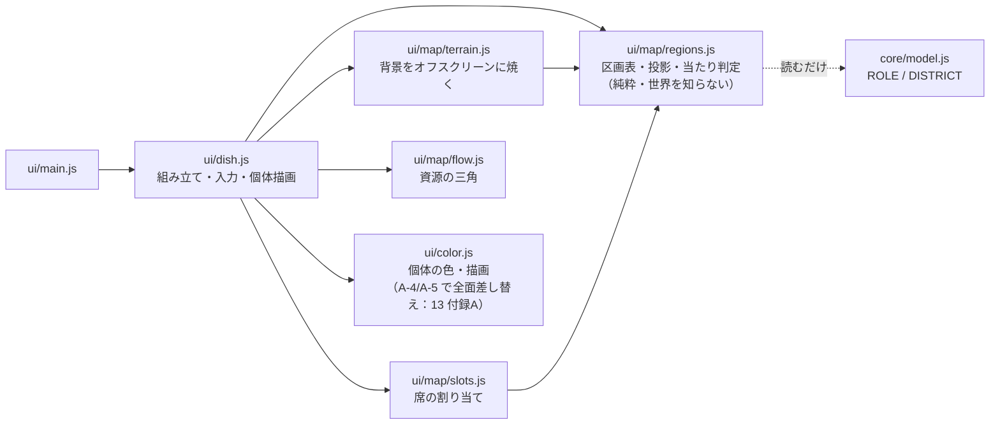
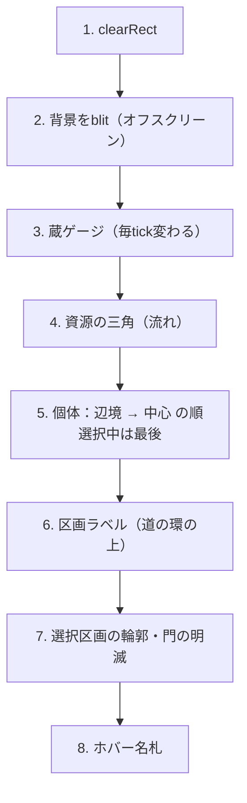

# 14 設計：村マップ

対象要件：**R-932（オーナー確定・SPEC上書き）村はマップにする。畑・狩り場・訓練場・中心・辺境など、それぞれの配置場所の背景が少なくとも見て分かること。**

現状（`game/src/ui/dish.js`）は「中心に多角形1つ ＋ 点線の円 ＋ 中心に食料の三角」だけで、
畑も狩り場も訓練場も**背景としては存在しない**。個体を `ROLE_ANGLE` で方角に振り分けてはいるが、
ラベルも地面も無いので、どの方角が何なのか画面からは絶対に分からない（04班の報告と一致）。

この文書はそれを「場所が見て分かるマップ」に置き換える設計。実装できる粒度まで数値で落とす。

---

## 0. 先に結論（この設計の芯）

1. **位置＝仕事、外側＝住まい。** 角度でどの区画（畑／狩り場／訓練場／集落）かを、半径で中心か辺境かを表す。
   これで `ROLE` と `DISTRICT` の2軸が、画面上の1つの点で同時に読める。
2. **畑の広さは `world.land` に比例させ、農夫はその中に詰める。**
   これだけで「働き手が土地を超えると1人あたりの取り分が減る」（規模の逓減）が、
   計算式ではなく**混み具合の絵**として勝手に出る。追加の演出はいらない。
3. **背景は世界の実値からしか描かない。** 数を暗示する飾りを置かない。
   飾ってよいのは「量を意味しない固定の風景」（木・杭・小屋）だけ。
4. **座標は UI だけが持つ。** sim には一行も足さない。マップは `world` を読むだけの純関数的な投影。

---

## 1. 村にある場所の一覧

| id | 表示名 | 何をする場所か（ホバー説明にそのまま使う） | sim側の対応 | 人が来る条件 |
|---|---|---|---|---|
| `core` | **中心（広場）** | 村の真ん中。蔵と長の家がある。 | ─（`world.food` / `world.bureaus`） | 局長だけが立つ。P1では無人 |
| `field` | **畑** | 食べものを作る場所。人が多すぎると1人あたりの取り分が減る。 | `ROLE.FARM` / `world.land` | いちばん人が多い区画 |
| `wood` | **狩り場（森）** | 食べものを作りながら、戦いの腕も伸びる。ケガをするし、死ぬこともある。 | `ROLE.HUNT` | `hunt_ratio` カードと適性で自動配役 |
| `drill` | **訓練場** | 食べものは作らないが、安全に戦いの腕が伸びる。 | `ROLE.DRILL` | **P1ではオーナーが名指しで置いたときだけ**（`world.js:568` が村では割合0固定） |
| `home` | **集落（家）** | 子どもと、仕事についていない人がいる場所。 | `ROLE.CHILD` / `ROLE.IDLE` | 常時。人口のおよそ4割 |
| `frontier` | **辺境**（各区画の外側の帯） | 村のはずれ。ここで育つと腕の伸びが速いが、死にやすい。 | `DISTRICT.FRONTIER` | `frontier` カードON、または `setDistrict` で名指し。**既定はOFFなので0人** |
| `gate` | **門** | 戦いに出ていく道。連れ帰った人はここから入る。 | `world.border`, `ROLE.WAR` | 捕虜が待っているとき／出征中 |
| `granary` | **蔵** | たくわえてある食べもの。線より下は、次の世代までもたない量。 | `world.food` | 常時 |

### DISTRICT と ROLE の対応を崩さないこと

`DISTRICT`（中心／辺境）と `ROLE`（畑／狩り／模擬戦／無役／子ども）は**直交する2軸**である。
農夫は中心にも辺境にも住む。子どもも中心にも辺境にもいる。片方だけを画面に出すと、
「辺境に住まわせる」というオーナーの主レバー（R-915 / R-422）が画面から消える。

だから：

```
    画面上の1点 = ( 角度 : どの仕事か , 半径 : 中心に住むか辺境に住むか )
```

| | 中心に住む（`DISTRICT.CENTER`） | 辺境に住む（`DISTRICT.FRONTIER`） |
|---|---|---|
| `FARM` | 村に近い畑（内側の帯） | 遠くの畑（外側の帯） |
| `HUNT` | 近い森 | 深い森 |
| `DRILL` | 村の訓練場 | 辺境の訓練場 |
| `IDLE` / `CHILD` | 集落の家 | 辺境の小屋 |
| `WAR` | ─ | 門の外（マップの外） |

同じ区画が内外2つの帯に分かれるだけなので、区画数は増えない。
そして**辺境の境界は1本の破線**なので、「誰が辺境にいるか」は一目で読める。

---

## 2. 座標系

### 2.1 描画領域（rect）

```
rect.x = 個体パネルが開いていれば その幅、閉じていれば 0
rect.y = 8                                     … 右上の血すじパネルを避ける上余白
rect.w = canvas幅 - rect.x
rect.h = canvas高 - 8
```

個体パネル（`#indpanel`, `width:min(400px,42%)`）が開いたら**マップは右へ寄って縮む**。
いまは盤面がパネルの下に潜ったままで、隠れた住人を選べない（04班「中」項目）。rect を動かせば直る。
rect の変化は 150ms で補間する（CSS のパネル開閉と揃える）。

### 2.2 半径のスケール

```
Rx = (rect.w / 2 - 18) / 1.16
Ry = (rect.h / 2 - 18) / 1.16
比 Rx/Ry を [0.72, 1.38] にクランプ（はみ出した側を縮める）
cx = rect.x + rect.w / 2
cy = rect.y + rect.h / 2 - 8
R̄ = sqrt(Rx * Ry)        … 面積・点サイズの基準に使う
```

`1.16` は「いちばん外側に描くもの（門の外の捕虜）の半径」。これで割ってあるので、**何を描いてもはみ出さない**。

### 2.3 投影式

```js
// r は 0..1.16 の正規化半径、θ は画面角（0 = 右, 時計回り, ラジアン）
function project(r, th) {
  return { x: cx + r * Rx * Math.cos(th), y: cy + r * Ry * Math.sin(th) };
}
// 逆変換（当たり判定用）
function unproject(x, y) {
  const dx = (x - cx) / Rx, dy = (y - cy) / Ry;
  return { r: Math.hypot(dx, dy), th: norm2pi(Math.atan2(dy, dx)) };
}
```

**円ではなく楕円に伸ばす**。`#stage` は 1280px 窓で 860×740、1440px 窓で 1020×840 と横長なので、
真円にすると左右が大きく余る。比 1.38 までなら「村っぽさ」は壊れない。

---

## 3. 配置表（これがマップの本体）

### 3.1 角度（区画の割り当て）

θ は画面角。`0 = 右（東）`、時計回りに増える（Canvas の y が下向きなので `0.5π = 下`）。

| 区画 | θ 開始 | θ 終了 | 中心角 | 度 | 画面上の方角 | なぜそこか |
|---|---|---|---|---|---|---|
| **畑** `field` | `0.20π` | `0.80π` | `0.60π` | 108° | 下（南） | いちばん人が多いので、いちばん広い面を取る。下は視線が最後に落ちる場所で、常に人がいる区画に向く |
| （道） | `0.80π` | `0.82π` | | 3.6° | | |
| **狩り場** `wood` | `0.82π` | `1.30π` | `0.48π` | 86° | 左（西〜西北西） | 畑の隣。どちらも食べものを作る場所なので隣接させ、「食べもの側は左下、戦い側は右」という左右の意味を作る |
| （道） | `1.30π` | `1.32π` | | 3.6° | | |
| **集落（家）** `home` | `1.32π` | `1.82π` | `0.50π` | 90° | 上（北） | 子ども＋無役で人口の約4割。画面上端は個体パネルにも凡例にも潰されない唯一の広い場所 |
| （道） | `1.82π` | `1.84π` | | 3.6° | | |
| **訓練場** `drill` | `1.84π` | `2.18π`(=`0.18π`) | `0.34π` | 61° | 右（東） | 門と同じ側。「鍛える → 出ていく」が右向きに一直線に並ぶ。P1ではたいてい空なので、いちばん狭い面でよい |
| （道） | `0.18π` | `0.20π` | | 3.6° | | |

合計 `1.92π`（区画）＋ `0.08π`（道4本）＝ `2π`。

区画の**中心角**（ラベル位置に使う）：畑 `0.50π` ／ 狩り場 `1.06π` ／ 集落 `1.57π` ／ 訓練場 `2.01π`。

### 3.2 半径（住まいの帯）

| 帯 | r 内 | r 外 | 中身 |
|---|---|---|---|
| 中心の広場 `core` | `0` | `0.30` | 蔵・囲い（多角形）・長の家。ふだんは無人 |
| 道の環 | `0.30` | `0.345` | 区画ラベルが載る環。人は置かない |
| **中心の土地** | `0.345` | `0.635` | `DISTRICT.CENTER` の住人 |
| 辺境の境（破線） | `0.65` | | 「ここから外は辺境」の1本 |
| **辺境の土地** | `0.665` | `0.98` | `DISTRICT.FRONTIER` の住人 |
| 村のはて | `0.98` | | 外周線 |
| 門の外 | `1.05` | `1.15` | 待機中の捕虜（`world.border`）、出征中（`ROLE.WAR`） |

#### 辺境の帯は「使われたら開く」

既定では `frontier` カードは OFF（`cards.js` の `defaultCards()` が全カード `on:false`）なので、
**辺境の住人は0人**。40世代回した実測でも常に0だった。
44%の半径をずっと空の暗闇にしておくのは無駄なので：

| 辺境の人数 | 辺境の境 | 辺境の土地 | 中心の土地 |
|---|---|---|---|
| 0人 | `0.88` | `0.895`〜`0.98`（細い縁だけ） | `0.345`〜`0.865` |
| 1人以上 | `0.65` | `0.665`〜`0.98` | `0.345`〜`0.635` |

切り替えは 0.6 秒で補間する。「辺境に人を置いた」瞬間に外側が開くので、
オーナーが自分の操作の結果を目で見る。**面積が量を意味しないこと**（人数はラベルが出す）を
守っているので、これは嘘にならない。

### 3.3 画面の絵（1280px 窓・個体パネル閉・rect 860×740 のとき）

```
   ┌──────────────────────────────────────────────────────────┐  y=0
   │                       ▲ 集落（家）                        │
   │              ┌───── 辺境の小屋 ──────┐                    │
   │         ┌────┴─── 集落 4人 ─────────┴────┐               │
   │      ／                                    ＼             │
   │    ／        ╭──── 道の環 ────╮              ＼           │
   │  ／  狩り場  │   ╭─────────╮   │   訓練場      ＼   ▶門  │  ← 門は右（ドック側）
   │ │    3人    │   │  蔵 52  │   │    0人        │   ┈┈▶  │
   │ │  （森）   │   │ ▁▂▃▄▅▆ │   │  （空）       │  捕虜1  │
   │  ＼          │   ╰─────────╯   │              ／          │
   │    ＼        ╰────────────────╯            ／            │
   │      ＼            畑 3人               ／                │
   │         └──────  辺境の畑  ──────────┘                   │
   │                       ▼ 畑                                │
   └──────────────────────────────────────────────────────────┘ y=740
   x=0                                                      x=860
```

### 3.4 実ピクセル例（rect 860×740 → `Rx=355`, `Ry=303`, `cx=430`, `cy=362`）

| 点 | r | θ | x | y |
|---|---|---|---|---|
| 畑ラベル | 0.33 | `0.50π` | 430 | 462 |
| 狩り場ラベル | 0.33 | `1.06π` | 315 | 343 |
| 集落ラベル | 0.33 | `1.57π` | 456 | 264 |
| 訓練場ラベル | 0.33 | `2.01π` | 547 | 365 |
| 畑の最外周 | 0.98 | `0.50π` | 430 | 659 |
| 集落の最外周 | 0.98 | `1.57π` | 506 | 72 |
| 狩り場の最外周 | 0.98 | `1.06π` | 88 | 306 |
| 門 | 0.98 | `2.01π` | 778 | 371 |
| 門の外（捕虜） | 1.10 | `2.01π` | 820 | 372 |

canvas は 860×740 なので、いちばん外の 820 でも右に 40px 残る。**どの点もはみ出さない**。

---

## 4. 背景の描き方（Canvas・アセットゼロ）

### 4.1 絶対に守る色の制約

**★ここは `07-オーナー追加要件.md` の A-4 / A-5 に合わせて差し替えた。**
旧版は「個体は `hsl(色相 = 血すじ, 彩度 52〜98%, 明度 14〜76%)`」を前提にしていたが、
**彩度＝熟練は A-4 が撤廃し、明度は A-5 で「弱っている度合いだけ」になった**（裁定は `REQUIREMENTS` X-01）。

差し替え後の個体の色は、`13-設計-個体の記号.md` §8 に従ってこうなる：

| チャンネル | 個体で何を表すか | 実際の値 |
|---|---|---|
| **色相** | **血すじ。これだけ** | 出会った順のラダー（`13 §8-2`） |
| **彩度** | **意味を持たない**（生きているあいだは固定） | OKLCH の `C = 0.084` 固定。死・退去のときだけ `C = 0` へ |
| **明度** | **弱っている度合いだけ**（ケガ・疲れ、戦闘中は恐怖） | `L = 0.78 → 0.52`（`13 §6-2`） |

**このゲームの看板は個体の色**（斑 → 混色）なので、地面が色で競合したら企画が死ぬ。
そのうえ **明度が「弱り」を意味するようになったので、地面が明るいと個体の暗さが読めなくなる。**
制約はゆるむのではなく、**きつくなる**：

> **地面は彩度20%以下・明度25%以下。区別は「色相の向き」と「模様」で付ける。**
> **地面をこれより明るくしない。**個体の「暗い＝弱っている」が背景に埋もれる。

**そして、地面にも色で意味を載せない**（A-5 の絶対規則）。
区画の別は**位置と模様**で付いている。地色は区別の補助でしかなく、
「この区画は危ないから赤」のような意味を地色に足してはいけない。
状態（崩壊・不足・過密）は**形と模様と文字**で言う。

### 4.2 区画ごとの塗り

| 区画 | 中心帯の地色 | 辺境帯の地色 | 模様 | 模様の描き方 |
|---|---|---|---|---|
| 中心の広場 | `#141a26` | ─ | 囲いの多角形 | 線 `rgba(110,200,180,0.34)`。**辺の数＝発展段階**（§6）。**崩壊中は色を変えず、囲いを二重線にして内側を `setLineDash([3,4])` の破線にする**（`15 §4-1` 脚注。A-5：警告を色で言わない。`dish.js:156` の赤は捨てる） |
| 畑（耕した所） | `#16241a` | `#111b14` | 畝（うね） | 中心角に**直交する円弧**を r 方向 9px 間隔。線 `rgba(150,200,140,0.13)`、幅 1 |
| 畑（未開墾） | `#14191a` | `#0f1416` | なし | 畝が無いので、耕した所との境が一目で分かる |
| 狩り場（森） | `#121e22` | `#0d171b` | 木 | 底辺 7px の小三角。区画内にポアソン配置（最小間隔 18px）。`rgba(130,190,165,0.15)` |
| 訓練場 | `#21201a` | `#191813` | 走路＋杭 | 区画中心に楕円の弧 `rgba(215,190,140,0.13)` 幅 2、両端に 4px の杭 |
| 集落（家） | `#231a14` | `#1a130f` | 小屋 | 一辺 11px の五角形（家の形）を**中心帯に3つ・辺境帯に1つ**固定。`rgba(232,178,74,0.16)` |
| 辺境の帯 | ─ | 上に `rgba(0,0,0,0.28)` を重ねる | 岩 | 2〜3px の点を疎に。`rgba(150,165,190,0.09)` |
| 道（4本） | `rgba(120,132,160,0.10)` | 同左 | ─ | 幅 `0.02π` の扇形。r `0.30`〜`0.98` |
| 道の環 | `rgba(120,132,160,0.07)` | ─ | ─ | r `0.30`〜`0.345` の環 |
| 辺境の境 | ─ | ─ | 破線 | `setLineDash([3,7])`、`rgba(130,150,190,0.30)`、幅 1.2 |
| 村のはて | ─ | ─ | 実線 | `rgba(90,105,135,0.22)`、幅 1 |
| 門 | ─ | ─ | 切れ目＋外への道 | 外周線を `±0.05π` 切り欠き、両脇に 6px の柱 `rgba(232,178,74,0.55)`。外へ点線 |

**模様の乱数は `new RNG(world.seed ^ 0x5AFE7E44)` で作る。**
`Math.random()` は禁止（同じ種から同じ世界＝同じ風景が出ること）。sim の RNG は絶対に消費しない。

### 4.3 「耕した所」の角度幅 ← ここが設計の芯

```js
const tilled = clamp(world.land / LAND_MAX, 0.15, 1);   // LAND_MAX = 45
const span   = 0.60 * Math.PI * tilled;                  // 畑区画の角度幅 × 比
const th0    = 0.50 * Math.PI - span / 2;                // 区画中心から左右に開く
const th1    = 0.50 * Math.PI + span / 2;
```

実測（種 20260820, 40世代）では `land` は 17.8 → 23.7。`23.7/45 = 0.53` なので
耕地は 108° のうち 57° ぶん。開墾が進めば左右に広がり、**土地が痩せれば縮む**。
01班が「農夫0人 → 土地が痩せる → 飢饉」の連鎖が画面から読めないと書いた箇所が、これで見える。

そして農夫は**耕した所の中にだけ詰める**（入りきらない分は未開墾側へあふれる）。
これで `landFactor = 1/(1+2.5×(働き手/土地 − 0.7))` という逓減式が、
**「畑がぎゅうぎゅうに見える」という絵**そのものになる。式を説明する文は要らない。

| 状態 | 働き手/土地 | 絵 |
|---|---|---|
| 余裕 | 0.2 | 広い畝の上に3人がぽつぽつ |
| 限界 | 0.7 | 畝が農夫で埋まる |
| 過密 | 1.7 | 隙間なし。未開墾の暗い側へあふれている |

過密（比 > 0.7）のときだけ、畑ラベルの下に `せまい（1人あたりの取り分が減っている）` を出す。

### 4.4 空の区画

人が0人の区画は、地色と模様のアルファを **×0.45** して沈める（0.4秒で補間）。
ラベルは出したまま「訓練場 0人」と書く。**消さない。**

P1では訓練場は原則0人（`world.js:568` が村では模擬戦の割合を0に固定している）。
つまり訓練場は「オーナーが名指しで置いたときだけ人がいる場所」であり、
**空っぽの訓練場は、初戦前に見せるべき最重要の絵**（R-116 練度ゼロのパニック）。
沈めて残すことで、そこが「使える場所なのに使っていない」と読める。

---

## 5. 人の置き方（150体でも潰れない）

### 5.1 スロット割り当て（位置を安定させる）

角度と半径をハッシュで散らす今のやり方だと、人が増えるほど団子になって重なる。
**区画ごとに席（スロット）を配り、いなくなったら空席として使い回す。**

```js
// 区画キー = `${role区画}.${district}`  … 8通り（畑/狩り場/訓練場/集落 × 中心/辺境）
class RegionSlots {
  taken = new Map();  // id -> slot番号
  free  = [];         // 空席（小さい順）
  acquire(id) { ... } // 空席があればそこ、無ければ末尾に追加
  release(id) { ... } // 死亡・区画移動で返す
}
```

- 誰かが死んでも他人の位置がずれない（席は空くだけ）。
- 配役を変えた個体だけが動く。**「動いたのが見える」**＝オーナーの操作の結果が読める。

### 5.2 スロット番号 → 座標（行詰め）

区画 `[θ0,θ1] × [r0,r1]` に `n` 人を詰める：

```
dot   = 成人の半径 S（§5.3 の scaleFor(pop)）。年齢で小さい個体も同じ席の格子に乗る
pitch = 2.4 * dot                                     … 目標の間隔
rows  = 1 から増やしながら、下の合計が n 以上になる最小値
          row k の半径 rk   = r0 + (k + 0.5) * (r1 - r0) / rows
          row k の定員 capk = floor((θ1 - θ0) * rk * R̄ / pitch)
列位置  = 行の中で等間隔。行ごとに 0.5 列ずらす（千鳥）
ゆらぎ  = hash01(id) から ±0.22 * pitch（角度・半径とも別ハッシュ）
```

`rows` を最大まで増やしても入らないときは `pitch` を段階的に縮める。
ただし **`pitch` を `2.0 * dot` より縮めない**（`13 §9-3` のキャラ班からの条件）。
下回りそうになったら、縮めるのではなく **`scaleFor` の段を1つ落とす**（＝全員が小さくなる）。
理由：席の間隔が直径を割ると円が重なり、**年輪と細胞が数えられなくなる**。数えられることが記号の生命線（A-4）。

> **★差し替え（A-4/A-5）**：旧版はここで `pitch < 1.9 * dot` を「過密」フラグにしていた。
> 上の下限（2.0）を入れると 1.9 には到達しないので、**「せまい」の判定は §4.3 の `働き手 / 土地 > 0.7` に一本化する。**
> 同じ状態に判定が2つあると食い違う（§11「二重の情報源にしない」と同じ理由）。
> `15 §4-1` の表が `pitch < 1.9×dot` を引用しているので、描画班にも同じ差し替えが要る。

### 5.3 個体の大きさ

**★ここは A-4（大きさ＝年齢）に合わせて全面差し替えた。**
旧版は `base = clamp(13 - pop * 0.05, 5.0, 13) * clamp(R̄ / 310, 0.72, 1.15)` で、
人口150のとき **5.5px**。この大きさでは **年輪も細胞も1つも描けない**（`15 §2-6` の実測）。
A-4 は大きさに「年齢」を、細胞の数に「熟練」を割り当てたので、**読める下限が要件になった。**

`13 §9-2` の段（ラダー）に一本化する（欠-14 への答え）。

```js
// 全体倍率 S ＝ 成人の半径。連続に動かさない。段でだけ動く
// （毎世代なめらかに変わると、人口が1増えるたびに全員の絵が変わる）
const LADDER = [[23, 32], [35, 26], [54, 21], [83, 17], [122, 14], [199, 11]];
export function scaleFor(pop) {
  for (const [maxPop, S] of LADDER) if (pop <= maxPop) return S;
  return 9;   // 下限。ここを割る設計にしてはいけない（割るくらいなら区画を広げる）
}
export const radiusOf = (ind, S) => S * K(ind.age ?? 0);   // K は 13 §3-2（0〜5歳を7段で刻む）
```

段の出どころは**この文書の区画の面積**である（`13 §9-1`）。
いちばん混む区画（畑・中心：延べ人数の 44.6%）で、丸どうしの間隔が直径の 1.1 倍を切らないことを条件にすると

```
成人の半径の上限 = 155.2 / sqrt(人口)
```

になる。上のラダーはこの式を段に丸めたもの。**面積の裏取りは §5.4 と矛盾しない。**

| 人口 | S（成人の半径） | 0歳の半径 | 畑の間隔 | 間隔 ÷ 直径 | 年輪 | 細胞の上限 | 旧式の base |
|---|---|---|---|---|---|---|---|
| 10 | 32 | 14.7 | 108px | 1.69 | 最大4本 | 19個 | 12.5 |
| 35 | 26 | 12.0 | 57px | 1.10 | 最大4本 | 19個 | 11.3 |
| 54 | 21 | 9.7 | 46px | 1.10 | 1本（位置で読む） | 7個 | 10.3 |
| 100 | 14 | 6.4 | 34px | 1.22 | 1本（位置で読む） | 3個 | 8.0 |
| 150 | 14 | 6.4 | 28px | 1.00 | 1本（位置で読む） | 3個 | **5.5** |
| 199 | 11 | 5.1 | 24px | 1.10 | 1本（位置で読む） | 3個 | 5.0 |

- **v2 の実運用は人口100まで**（`world.land` 45 × `POP_PER_LAND` 2.6 = 117 が sim 側の天井）。
  そこでは **S = 14 以上**。旧式の 5.5 に対して **2.5倍**。`15 §2-6` の「下限 10.0 以上」も満たす。
- 年輪の本数が読めるのは **S = 26 以上（人口35まで）**。そこから先は「輪1本の位置」で年齢を読む（`13 §3-3`）。
  村は10体で止まる設計（R-103）なので、**1体1体を見つめる場面では必ず本数が読める。**
- 人口150は P2 の天井を超えた異常時の絵。間隔が直径ぴったりになる。
  重なりはしないが混む。**混んで見えるのが正しい**（§5.4 と同じ判断）。
- 段は6つだけ。**毎世代ぬるぬる変わらない。**

窓の大きさによる係数（旧版の `clamp(R̄ / 310, ...)`）は掛けない。
ラダーは `13 §9-1` が **X-06 の確定寸法 900×744** で測り直した値なので、
1280px 窓ではそのまま使える。窓が広がった場合だけ `R̄ / 335` を上限 1.15 で掛けてよい（**下げる向きには使わない**）。

### 5.4 面積の裏取り（旧・rect 860×740, R̄ ≈ 328）

| 帯 | 正規化面積 | 実面積 |
|---|---|---|
| 中心の土地（全区画） | `π(0.635² − 0.345²) = 0.893` | 96,100 px² |
| 辺境の土地（全区画） | `π(0.98² − 0.665²) = 1.628` | 175,200 px² |
| 合計 | 2.521 | **271,300 px²** |

> **★この表は旧版のまま残してある（前提が2つ古い）。**
> ①盤面の寸法は X-06 で **900×744** に確定した。②個体の半径は §5.3 のラダーに変わった。
> **測り直した表は `13 §9-1`〜`§9-2` にある**（区画ごとの面積・いちばん混む区画の割合・人口ごとの間隔÷直径）。
> 結論は変わらない（面積は余る。詰まるのは区画ごとの席の割り当て）ので、下の考え方はそのまま読める。

- 人口150人が全員 → 1人あたり 1,808 px²（間隔 42px、点の直径 11px）。**余裕**。
- 人口150人が全員 畑・中心帯・耕地(53%) に集中した最悪ケース
  → `0.893 × (108/360) × 0.53 = 0.142` → 15,300 px² → 1人 102 px²（間隔 10px）。
  **これは「本当にぎゅうぎゅう」な状態なので、ぎゅうぎゅうに見えるのが正しい。**
- 実運用の上限は P2 の 100体。`world.land` の上限 45 × `POP_PER_LAND` 2.6 = 117 が sim 側の実効天井。

---

## 6. 発展段階でマップがどう変わるか

SPEC の「多角形の辺の数＝発展段階」は**中心の囲いとして残す**（既存 `Dish.stage()` をそのまま使う）。
マップにしたことで増える成長の見せ方は、**すべて世界の実値から出す**：

| 何が変わるか | 何の値から | 効果 |
|---|---|---|
| 中心の囲いの**辺の数** | 人口（3辺 <5 / 4辺 <10 / 5辺 <20 / 6辺 <40 / 7辺 <70 / 8辺 <100 / 9辺 ≥100） | 村の格が上がる。SPECの規則をそのまま維持 |
| **耕地の角度幅** | `world.land / 45` | 開墾で広がり、放置で縮む |
| **辺境の帯が開く** | 辺境の住人 ≥1 | オーナーが辺境レバーを使った瞬間に外側が開く |
| **蔵の目盛り上限** | `30 + 人口 × 5`（`FOOD_CAP_BASE + pop × FOOD_CAP_PER_HEAD`） | 数字で出す。箱の大きさは固定 |
| **区画が点灯／沈む** | 各区画の人数 0 か 1以上 | 使っていない場所が沈む |
| **門が開く** | `world.border.size > 0` または `lastWarGen` が近い | 捕虜が待っていることが盤面から分かる |

**やらないこと**：家の数を人口から作って増やす、木を増やす、装飾を段階で足す。
量を暗示する飾りは「事実は常に正確に見える」（R-001）に反する。
木・杭・小屋は**固定の風景**（数が何も意味しない）としてのみ置く。

---

## 7. 食べもの（資源）の見せ方

いまは中心に小さい三角が最大30個、円周に並ぶだけ。数えられないし、上限も分からない。

### 7.1 蔵（ストック）

中心の広場の中、`C + (0, −0.10R)` に固定サイズの箱を置く。

```
箱      : 幅 0.34R × 高さ 0.24R（860×740 のとき 121 × 73 px）
詰まり  : world.food / (30 + 人口 × 5)   を下から塗る
1世代線 : world.consumption × 12（TICKS_PER_GEN）/ 上限   の高さに横線
数字    : 箱の中央に world.food（16px, --tx）
```

**1世代線がこの設計の要**。実測（人口10・世代9）では 備蓄52 / 上限80 / 1世代の消費46 なので、
線は 57.5% の高さ、詰まりは 65%。**「あと少しで1世代ぶんを割る」が絵で出る。**

**★状態の出し方は A-5 に合わせて色から形へ差し替えた。**（`--warn` / `--bad` を使わない）

| 状態 | 見た目 |
|---|---|
| 詰まり > 線 | 塗り `rgba(232,178,74,0.72)`、枠 `rgba(232,178,74,0.5)`、1世代線は幅 1 |
| 詰まり ≤ 線 | 塗りが線の下。**1世代線を幅 2.5 に太らせ**、線の横に `1世代もたない` と書く。**枠の色は変えない** |
| `world.collapsing` | **蔵の枠を二重にし、内側を `setLineDash([3,4])` の破線にする。**中心の囲いも同じ（§4.2）。**色は変えない** |

「二重に見える＝ふつうでない」は色を1つも使わずに伝わり、白黒でも残る（`15 §4-1` 脚注）。
`dish.js:156` の `world.collapsing ? 'rgba(226,96,74,0.85)' : …` は捨てる。

### 7.2 三角は「流れ」にする（SPEC の「資源＝小さい三角」を保つ）

三角を在庫の数え札にするのはやめ、**動きに使う**。

| 流れ | 出どころ → 行き先 | 本数 | 色 |
|---|---|---|---|
| 入る | 畑・狩り場のランダムな人 → 蔵 | `world.yieldRate` に比例（1本 ≒ 0.5/tick） | `rgba(232,178,74,0.55)` |
| 出る | 蔵 → 集落 | `world.consumption` に比例 | `rgba(150,165,190,0.40)` |

- 三角のサイズ 3px、速度は一定（1.6秒で到達）、**同時に生きている粒は最大 48 個**でクランプ。
- **入る／出るの区別は、色ではなく「向き」と「出どころ」で付ける**（A-5）。三角は**進む方向に尖らせる**。
  上の2色は地の材質の差でしかない。**色だけで読ませない。**
- 入る流れより出る流れが太ければ、それが「減っている」の正体。
  トップバーの `産出÷消費` が数字で言っていることを、盤面が動きで言う。
- 農夫が0人になった世代は入る流れが**止まる**。01班が挙げた飢饉の起点が、一目で分かる。

---

## 8. 門と、外にいる者

| 何を | どこに | どう描く |
|---|---|---|
| 待機中の捕虜（`world.border`） | r `1.05`〜`1.15`, θ `1.94π`〜`2.08π` | 個体をアルファ 0.62 で。血すじの色相はそのまま（＝外の色が門の外に見えている） |
| 出征中（`ROLE.WAR`） | 同上、門のすぐ外 | アルファ 0.5、外向きの小さな矢印 |
| 門そのもの | r `0.98`, θ `2.01π` | 外周線の切り欠き＋柱2本。捕虜が居るときは 1.6 秒周期でゆっくり明滅 |
| ラベル | 門の外 | `門の外に 1人`（待機中のみ） |

これは表示だけではなく**詰みの保険**になる。03班／04班が挙げた
「国境画面を閉じると捕虜が宙に浮き、決めるボタンが行き止まりになる」件は、
捕虜が門の外に見えていれば少なくとも**盤面から気づける**（クリックで国境画面を開き直す導線を、導線班が張れる）。

---

## 9. 状態と操作

### 9.1 ホバー

| 対象 | 出るもの |
|---|---|
| 個体 | いまの名札（`名前 6歳`）＋ **`畑にいる／中心に住んでいる`** を追加 |
| 区画 | 表示名 ＋ §1 の説明文 ＋ `いま N人`。DOM のツールチップで出す（R-933 の辞書と同じ仕組みに乗せる） |
| 辺境の境 | `ここから外は辺境。腕の伸びが速いが、死にやすい。` |
| 蔵 | `たくわえてある食べもの。線より下は、次の世代までもたない量。` |

区画の当たり判定は `unproject()` → `(r, θ)` → 区画表の照合だけ。1回の比較で済む。

### 9.2 選択

- 個体を選ぶと、**その個体がいる区画の輪郭が光る**（`rgba(143,180,255,0.35)`, 幅 2）。
  「この子はここにいる」が言葉なしで分かる。
- 個体パネル（`--ind` 青系）と国の画面（`--ac` 緑系）の色分けは既存規則を守る。区画の光は**個体側の青**。
  これは**画面の持ち物の色分け**（いまどちらのスコープを見ているか）であって、個体の状態を表す色ではない。
  A-5 が禁じているのは「状態・所属・役割・警告に色を使うこと」なので、ここは触れない。
  ホバーと選択のハローも同じ扱い（**状態ではなく操作の反応**：`13 §14-2`）。

### 9.3 移動のアニメーション

配役や居住区を変えたら、その個体は**道を通って**新しい席へ動く。

```
区画が変わった → 目標を2段にする
  ① 道の環（r = 0.32）の、移動元と移動先のあいだの道の角度
  ② 新しい席
①に 0.35 以内まで近づいたら②へ切り替える
```

直線で他人の区画を突っ切ると「あの子は畑を通っている」と誤読される。道を通れば読み違えない。
ばねの係数と `dt` の上限（`dt = min(0.05, ...)`）は既存のまま。**ここを緩めると座標が発散する**（dish.js の既存コメント）。

### 9.4 クリックで置く（提案・要合意）

`roles.js` は「① 名前を押して選ぶ → ② 置きたい場所の『ここへ置く』を押す」という2段。
マップでも同じ2段を成立させられる：**個体を選んだ状態で区画をクリック＝そこへ置く**。

- 文字入力なし・クリックのみ（R-901）を守る。
- 区画にカーソルを乗せたとき、選択中の個体がいれば `ここへ置く` と輪郭を光らせる。
- `assignRole` / `setDistrict` を呼ぶだけ。sim には何も足さない。

→ **導線班と `roles.js` の担当と合意が要る**（同じ操作が2箇所にあることの是非）。合意が取れなければ表示のみ。

---

## 10. 実装

### 10.1 ファイル分割



`dish.js` の外向きの形（`new Dish(canvas)` / `sync(world)` / `update(world, dt)` / `draw(world)` / `onPick` / `hover` / `selected`）は**変えない**。
`main.js` の変更は「個体パネルの開閉を `dish.setRect()` に伝える」1点だけで済む。

### 10.2 描画順



ラベルは道の環（r 0.30〜0.345）に置くので、**人の上に重ならない**（そこに席を作らないため）。

### 10.3 背景のキャッシュ

背景（`terrain`）は毎フレーム描かない。オフスクリーン canvas に焼いて blit する。

```
キャッシュキー = `${rectW}x${rectH}|${囲いの辺数}|${Math.round(land*2)}|${辺境が開いているか}|${各区画が0人か}|${collapsing}`
```

`Math.round(land*2)` で耕地幅を 0.5 刻みに丸める（毎tick わずかに動く `land` で焼き直さないため）。
実測で `land` は1世代あたり 0.3 程度しか動かないので、焼き直しは数世代に1回。

区画の点灯／沈み と 辺境の開閉 は**補間中だけ**毎フレーム描く必要があるので、
この2つはオフスクリーンではなく本体側で `globalAlpha` を掛けて重ねる（キーには「終状態」だけ入れる）。

### 10.4 sim との境界（絶対に守る）

- マップが `world` から読むのは：`people`（`id, role, district, age, genes, skills, lineage, alive, bureau, foreign, wounded, fatigue`）、`land`, `food`, `consumption`, `yieldRate`, `morale`, `collapsing`, `border`, `bureaus`, `phase`, `seed` **だけ**。
- **`world` に座標を書き込まない。** 席は `Dish` 側の `Map` が持つ。
- 乱数は `new RNG(world.seed ^ 定数)` を UI 側で作る。`Math.random()` と `Date.now()` は使わない。
- sim のファイルは 1 行も触らない。

---

## 11. やらないこと

| やらない | なぜ |
|---|---|
| 高さ・影・グラデーションの立体表現 | **個体の明度（＝弱っている度合い。A-5）と競合する。**地面は平らに保つ。明るい床の上では「暗い個体」が読めない |
| **地面や飾りに色で意味を載せる**（危ないから赤、足りないから橙…） | **A-5 の絶対規則。**後半は血が混ざって個体の色が濁るので、色に載せた意味はそこで全部読めなくなる。状態は形と模様と文字で言う |
| 区画の面積を人数に比例させる | 面積が量になると、人数ラベルと二重の情報源になって食い違う |
| 建物を段階で足していく（学舎・鍛冶…） | v2 の sim にその値が無い。無い値を絵にしない |
| 川・山などの地形 | 環境係数は `district` の2値しかない。2値を5個の地形に見せるのは嘘 |
| 個体の移動を「歩行アニメ」にする | 体は**核（細胞）・年輪帯・外周線の3層**（`13 §1-2`）。歩行で形を崩すと年輪も細胞も数えられなくなる。動くのは位置だけ |
| ミニマップ・ズーム・パン | 1画面に1つの用件（R-904）。村は1画面に収まる |

---

## 12. 受け入れの基準（この設計が実装できたと言える条件）

1. 起動直後（人口2）に、**畑・狩り場・訓練場・集落・中心・辺境の6つが背景として区別できる**。ラベルに人数が出ている。
2. 個体を1体クリックすると、その個体がいる区画の輪郭が光る。ホバーで `畑にいる／中心に住んでいる` が出る。
3. `frontier` カードを ON にすると、**外側の帯が開いて**そこに人が移動する。破線の内と外で誰が辺境かが読める。
4. 農夫を全員畑に置くと、耕地が広がっていくのが世代をまたいで見える。逆に農夫を0にすると耕地が縮む。
5. 農夫を過剰に置くと、耕地が人で埋まり、`せまい` が出る。`landFactor` の数字を見なくても取り分が減っていると分かる。
6. 蔵の詰まりが1世代線を割ると、割ったことが分かる。三角の入る流れと出る流れの太さが逆転している。
7. 人口150体（デバッグで強制）でも、**個体がマップからはみ出さず、区画の境界が読め、30fps を割らない**。
   - **7-a（A-4 追加）** 人口100（P2 の天井）で、**成人の半径が 14px 以上あり、細胞3個と年輪1本が数えられる**（§5.3 / `13 §9-2`）。
     人口が段をまたぐ瞬間に、全員の大きさが**一度だけ**変わる（連続に動かない）。
   - **7-b（A-5 追加）** **地面の明るさが個体の暗さを邪魔しない。**ケガをした個体と元気な個体を並べたとき、
     どの区画の上でも「暗いほうが弱っている」と読める（§4.1）。
8. 個体パネルを開くとマップが右に寄り、パネルの下に住人が隠れない。
9. 捕虜が待っているとき、門の外にその個体が見えている。
10. 同じ種で2回起動すると、**木・岩・小屋の位置まで完全に同じ**（`Math.random()` を1つも使っていない証明）。

---

## 付録A：区画表（実装用のリテラル）

```js
export const PI = Math.PI;

export const BANDS = {
  core:        { r0: 0.000, r1: 0.300 },
  ring:        { r0: 0.300, r1: 0.345 },   // 道の環。席は作らない
  center:      { r0: 0.345, r1: 0.635 },   // 辺境が閉じているときは r1 = 0.865
  edge:        { r: 0.650 },               // 辺境の境（閉 0.880）
  frontier:    { r0: 0.665, r1: 0.980 },   // 閉 0.895 〜 0.980
  rim:         { r: 0.980 },
  outside:     { r0: 1.050, r1: 1.150 },
};

export const WARDS = [
  { id: 'field', name: '畑',        th0: 0.20 * PI, th1: 0.80 * PI, mid: 0.50 * PI,
    roles: ['farm'],           tilled: true },
  { id: 'wood',  name: '狩り場',    th0: 0.82 * PI, th1: 1.30 * PI, mid: 1.06 * PI,
    roles: ['hunt'] },
  { id: 'home',  name: '集落',      th0: 1.32 * PI, th1: 1.82 * PI, mid: 1.57 * PI,
    roles: ['child', 'idle'] },
  { id: 'drill', name: '訓練場',    th0: 1.84 * PI, th1: 2.18 * PI, mid: 2.01 * PI,
    roles: ['drill'] },
];

export const ROADS = [0.19 * PI, 0.81 * PI, 1.31 * PI, 1.83 * PI];
export const GATE  = { th: 2.01 * PI, half: 0.05 * PI };
```

## 付録B：他班へ渡すもの

| 相手 | 渡すもの |
|---|---|
| 用語班（R-933 の辞書） | §1 の表示名と説明文8件。区画も辞書の項目にする。`畑` `狩り場` `訓練場` `集落` `中心` `辺境` `門` `蔵` |
| 用語班 | 「狩り／狩猟」「模擬戦／訓練」の表記ゆれ。**マップの地名に合わせて `狩り場` `訓練場` に統一する**ことを提案（05班の指摘に対する答え） |
| 導線班 | §9.4「個体を選んで区画をクリック＝置く」の可否。`roles.js` の2段操作と重複する |
| 導線班 | 門の外の捕虜をクリック → 国境画面を開き直す（03班・04班の「捕虜が宙に浮く」詰みの保険） |
| UI基盤 | `#strains`（右上の血すじパネル）とマップ上端の干渉。rect の上余白 8px で逃げているが、パネルを左上か下に移せるならそのほうが良い |
| UI基盤 | `#indpanel` 開閉を `dish.setRect()` に伝える1行（`main.js`）。**※ X-05 で「個体パネルは盤面を縮めない」が決まったので、この1行は要らなくなった可能性がある。UI班と確認すること** |
| キャラ班（13） | §5.3 の `scaleFor(pop)` を**両文書で1本にする**ことに合意した（欠-14）。席の間隔は `2.0 × 成人の半径` を下回らせない（§5.2 / `13 §9-3`） |
| 描画班（15） | 「せまい」の判定を `pitch < 1.9×dot` から **`働き手 / 土地 > 0.7`** に一本化した（§5.2）。`15 §4-1` の表も同じ差し替えが要る |
| 描画班（15） | 崩壊 `collapsing` を**赤で出さない**（§4.2 / §7.1）。二重線＋内側破線に置き換え済み（`15 §4-1` 脚注の要求に対する回答） |

---

## 付記. A-4/A-5 に合わせた差し替え（2026-08-20 追記）

この文書は `07-オーナー追加要件.md` の **A-4 / A-5 より前**に書かれたので、
撤廃された記号（彩度＝熟練・明度＝年齢と体力・目2つ）を前提にした記述が残っていた
（`99-抜けの指摘.md` 欠-02：「14 §4.1 が `hsl(色相, 彩度52〜98%, 明度14〜76%)` を地面の色制約の根拠にしている」）。
**A-4 / A-5 と、書き直された `13-設計-個体の記号.md` / `15-設計-描画.md` に合わせて、記号と色に関わる箇所だけを差し替えた。**
区画の割り当て・角度・帯・投影式・背景の模様・門・移動・実装分割には手を触れていない。

### 差し替えた箇所

| # | 場所 | 前 | 後 |
|---|---|---|---|
| 1 | §4.1 | 「個体は `hsl(色相, 彩度52〜98%, 明度14〜76%)` で描かれる」を地面の制約の根拠にしていた | **差し替え後の3チャンネル表**（色相＝血すじだけ／彩度＝意味なし・`C=0.084` 固定／明度＝弱っている度合いだけ）。制約は**ゆるまずきつくなる**（`地面をこれより明るくしない`）。**地面にも色で意味を載せない**を追記 |
| 2 | §4.2 中心の広場 | 「崩壊中は `rgba(226,96,74,0.85)`」＝**赤** | **色を変えず、囲いを二重線にして内側を破線**（`15 §4-1` 脚注。`dish.js:156` の赤は捨てる） |
| 3 | §5.2 | `dot = 個体の描画半径` としか書いていなかった | `dot = 成人の半径 S`（年齢で小さい個体も同じ格子に乗る）と明記 |
| 4 | §5.2 | `pitch < 1.9 * dot` で「過密」フラグ | **`pitch` を `2.0 * dot` より縮めない**（`13 §9-3`）。下回りそうなら `scaleFor` の段を1つ落とす。**「せまい」の判定は §4.3 の `働き手 / 土地 > 0.7` に一本化** |
| 5 | **§5.3** | `base = clamp(13 - pop*0.05, 5.0, 13) × clamp(R̄/310, …)`。人口150で **5.5px**。「**円と縦長の目2つは 5px でも成立する**」 | **`scaleFor(pop)` の6段ラダー**（`13 §9-2`）。人口150で **14px**。段の出どころ（`155.2/√人口`）・人口ごとの表・年輪と細胞が読める境目を明記。**目の記述は削除**（A-4 で撤廃） |
| 6 | §5.4 | 旧寸法・旧半径のままの面積表 | **前提が2つ古いことを明記**し、測り直した表（`13 §9-1`〜`§9-2`）へ誘導。結論（面積は余る）は変わらない |
| 7 | §7.1 蔵 | `詰まり ≤ 線` で枠が `--warn`、`collapsing` で枠が `--bad`・囲いも**赤** | **1世代線を太らせる／枠を二重線＋内側破線**。**色は変えない**（A-5） |
| 8 | §7.2 三角の流れ | 入る／出るを**色**で分けていた | **向きと出どころで分ける。**三角を進行方向に尖らせる。色だけで読ませない |
| 9 | §9.2 選択 | `--ind` 青／`--ac` 緑の色分け | **そのまま残す。**画面の持ち物の色分けと操作の反応（ハロー）は、A-5 が禁じた「状態・所属・役割・警告の色」に当たらないことを明記 |
| 10 | §10.1 図 | `ui/color.js（既存・変更なし）` | **A-4/A-5 で全面差し替え**（`13` 付録A） |
| 11 | §11 やらないこと | 立体表現の理由が「個体の明度（＝**年齢・体力**）と競合」 | 「個体の明度（＝**弱っている度合い**）と競合」。**「地面や飾りに色で意味を載せる」を1行追加** |
| 12 | §11 やらないこと | 歩行アニメを禁じる理由が「**円＋目2つ**（R-930）を崩さない」 | 「体は**核・年輪帯・外周線の3層**。歩行で形を崩すと年輪も細胞も数えられなくなる」 |
| 13 | §12 受け入れの基準 | 密度と fps だけ | **7-2（人口100で半径14px以上・細胞3個と年輪1本が数えられる）**、**7-3（地面の明るさが個体の暗さを邪魔しない）** を追加 |
| 14 | 付録B | 3班ぶん | キャラ班（`scaleFor` 合意）・描画班（「せまい」の判定・崩壊を赤にしない）の3行を追加。`setRect` の行に X-05 の注記 |

### 触っていない箇所（他班の担当なので、ここでは決めない）

| 残る食い違い | いまの状態 | 誰が決めるか |
|---|---|---|
| 盤面の寸法 | §2.1・§3.3・§3.4・§5.4 は **860×740**。X-06 は **900×744** を正と裁定した | 欠-17 / X-06。UI班が1か所に書き、この文書が引用する形にする。**記号の意味とは無関係なので今回は動かさなかった**（半径ラダーだけは `13 §9-1` が 900×744 で測り直したものを採った） |
| 個体パネルで盤面が縮むか | §2.1 と §12-8 は「右に寄る」前提。X-05 は「**縮めもしない**」と裁定した | 欠-16。UI班（骨格の持ち主）。決まったら §2.1 と §12-8 を消す |
| 席の式を `slots.js` 1本にすること | §5.1-5.2 の行詰めを採る（`13 §9-3` が六方格子を取り下げて合流済み） | 欠-32。あとは実装単位まで落とすだけ |
| §9.4「個体を選んで区画をクリック」 | X-10 で**認められた**（2段操作の入口が2箇所にあるのは可） | 決着済み。文面の「要合意」は導線班が外す |
